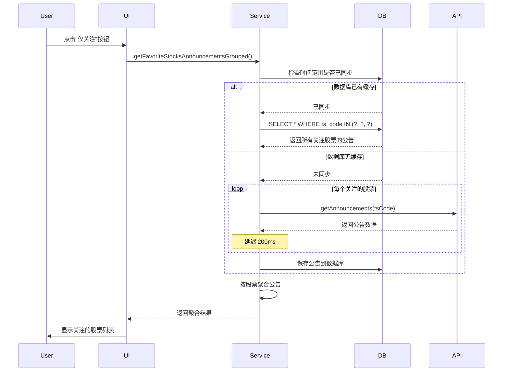
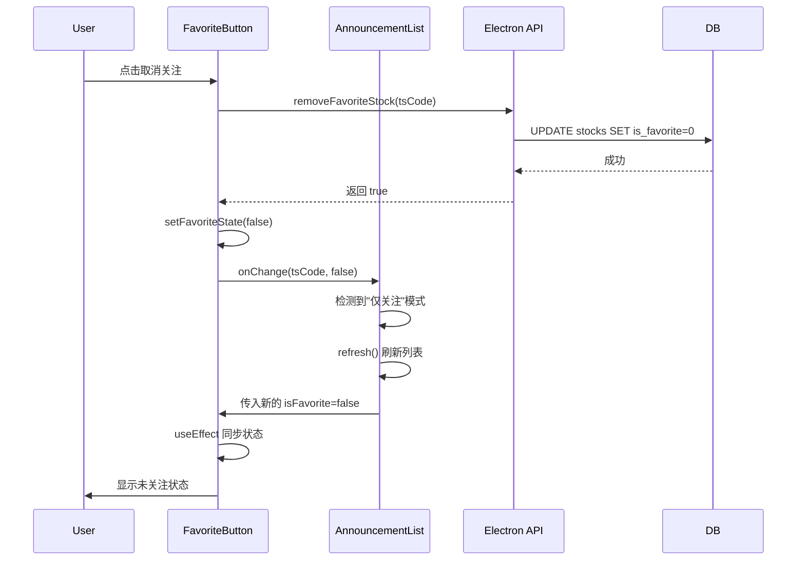

# 关注功能 Bug 修复

## 修复日期
2025-12-16

## Bug 描述

### 问题 1：多个关注股票时无法显示
**现象**：当关注两个及以上股票时，点击"关注"按钮，股票列表没有显示对应的股票。仅关注一只股票时正常显示。

**原因**：
- `getFavoriteStocksAnnouncementsGroupedFromAPI` 函数使用 `join(",")` 将多个股票代码连接后传给 API
- Tushare API 无法正确处理这种格式的多个股票代码
- 没有利用数据库缓存，每次都从 API 查询

**修复方案**：
1. **优先使用数据库查询**：使用 SQL `IN` 子句查询多个股票代码
   ```sql
   SELECT * FROM announcements 
   WHERE ts_code IN (?, ?, ?)
   AND ann_date >= ? AND ann_date <= ?
   ```
2. **改进 API 查询方式**：当数据库无缓存时，逐个股票代码查询 API
3. **添加延迟**：多个 API 请求之间添加 200ms 延迟，避免限流

**修改文件**：
- `electron/main.ts` - `getFavoriteStocksAnnouncementsGroupedFromAPI` 函数

### 问题 2：取消关注后按钮状态不更新
**现象**：取消关注后，列表刷新了，但关注按钮仍然显示为已关注状态（黄色实心星）。

**原因**：
- `FavoriteButton` 组件使用内部状态 `favoriteState` 管理按钮显示
- 当父组件传入的 `isFavorite` prop 变化时，内部状态没有同步更新
- 导致按钮显示的状态与实际数据不一致

**修复方案**：
添加 `useEffect` 监听 `isFavorite` prop 的变化，当 prop 变化时同步更新内部状态：

```typescript
useEffect(() => {
    setFavoriteState(isFavorite);
}, [isFavorite]);
```

**修改文件**：
- `src/components/FavoriteButton.tsx`

## 修复后的功能流程

### 关注多个股票的查询流程



### 取消关注的状态同步流程



## 测试验证

### 测试场景 1：多个关注股票显示
1. ✅ 关注 3 个股票
2. ✅ 点击"关注"按钮切换到"仅关注"模式
3. ✅ 列表正确显示所有 3 个关注的股票
4. ✅ 从日志可见：`[DB Cache Hit] 从数据库读取到 14 条关注股票公告`
5. ✅ 聚合结果：`items=3, total=3`

### 测试场景 2：取消关注状态同步
1. ✅ 在"仅关注"模式下点击某个股票的关注按钮
2. ✅ 按钮状态立即变为未关注（空心星）
3. ✅ 列表自动刷新，移除该股票
4. ✅ 刷新页面后，按钮状态保持正确

### 测试场景 3：关注状态持久化
1. ✅ 关注多个股票后关闭应用
2. ✅ 重新打开应用
3. ✅ 所有关注状态正确显示
4. ✅ "仅关注"模式正常工作

## 性能优化

### 数据库查询优化
- 使用 `IN` 子句一次查询多个股票，避免多次查询
- 利用索引 `idx_stock_is_favorite` 加速查询
- 优先使用数据库缓存，减少 API 调用

### API 调用优化
- 仅在数据库无缓存时才调用 API
- 逐个股票查询，避免 API 格式问题
- 添加 200ms 延迟，避免触发 API 限流
- 查询结果保存到数据库，供后续使用

## 相关文件

### 修改的文件
- `electron/main.ts` - 修复多股票查询逻辑
- `src/components/FavoriteButton.tsx` - 修复状态同步问题

### 相关文件（无需修改）
- `electron/db.ts` - 数据库操作（已有正确实现）
- `src/components/AnnouncementList.tsx` - 列表组件（已有正确实现）
- `src/hooks/useStockList.ts` - 列表 Hook（已有正确实现）
- `src/services/stockService.ts` - 服务层（已有正确实现）

## 注意事项

1. **状态同步**：`FavoriteButton` 现在会自动同步父组件传入的 `isFavorite` prop
2. **数据库优先**：优先使用数据库查询，提高响应速度
3. **API 限流**：多个 API 请求之间有延迟，避免触发限流
4. **错误处理**：API 查询失败不会影响其他股票的查询

