# 公告列表业务流程图

本文档描述公告列表模块的核心业务流程及各种子业务场景。

---

## 1. 核心业务流程 - 公告列表加载流程

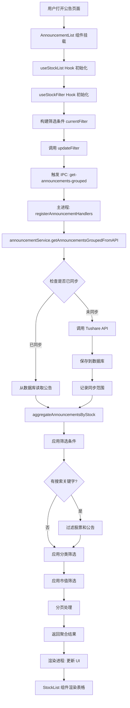

### 实现类映射表

| 流程节点 | 实现类/组件 | 文件路径 | 职责说明 |
|---------|-----------|---------|---------|
| 用户打开公告页面 | `Announcements` | `src/pages/Announcements.tsx` | 页面容器组件 |
| AnnouncementList 组件 | `AnnouncementList` | `src/components/AnnouncementList.tsx` | 核心UI组件，管理列表状态 |
| useStockList Hook | `useStockList` | `src/hooks/useStockList.ts` | 数据加载和分页管理 |
| useStockFilter Hook | `useStockFilter` | `src/hooks/useStockFilter.ts` | 筛选条件管理 |
| IPC 调用 | `window.electronAPI` | `src/electron.d.ts` | IPC 接口定义 |
| 主进程 Handler | `registerAnnouncementHandlers` | `electron/ipc/announcement.ts` | IPC 处理器注册 |
| 业务逻辑层 | `announcementService` | `electron/services/announcement.ts` | 公告业务逻辑 |
| 数据访问层 | `AnnouncementRepository` | `electron/repositories/implementations/AnnouncementRepository.ts` | 数据库操作 |
| API 客户端 | `TushareClient` | `electron/tushare.ts` | Tushare API 调用 |
| 数据聚合 | `aggregateAnnouncementsByStock` | `electron/services/announcement.ts` | 按股票聚合公告 |
| UI 渲染 | `StockList` | `src/components/StockList/StockList.tsx` | 表格组件 |

---

## 2. 搜索业务流程

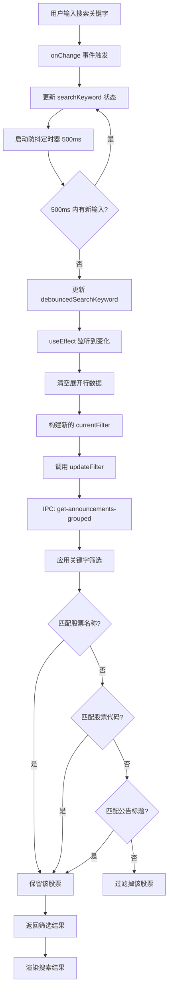

### 实现类映射表

| 流程节点 | 实现类/组件 | 文件路径 | 职责说明 |
|---------|-----------|---------|---------|
| 输入组件 | `Search` (Ant Design) | `src/components/AnnouncementList.tsx` | 搜索输入框 |
| 防抖处理 | `useEffect + setTimeout` | `src/components/AnnouncementList.tsx` | 防抖逻辑 |
| 搜索过滤 | `announcementService` | `electron/services/announcement.ts` | 搜索业务逻辑 |
| 股票搜索 | `StockRepository.searchStocks` | `electron/repositories/implementations/StockRepository.ts` | 股票名称/代码搜索 |
| 公告搜索 | `AnnouncementRepository.searchAnnouncements` | `electron/repositories/implementations/AnnouncementRepository.ts` | 公告标题/内容搜索 |

---

## 3. 搜索历史管理流程

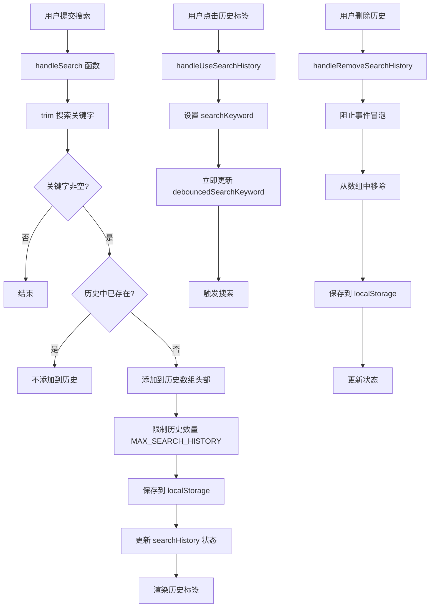

### 实现类映射表

| 流程节点 | 实现类/组件 | 文件路径 | 职责说明 |
|---------|-----------|---------|---------|
| 搜索提交 | `handleSearch` | `src/components/AnnouncementList.tsx` | 搜索处理函数 |
| 历史管理 | `useState + localStorage` | `src/components/AnnouncementList.tsx` | 搜索历史状态管理 |
| 历史使用 | `handleUseSearchHistory` | `src/components/AnnouncementList.tsx` | 使用历史记录 |
| 历史删除 | `handleRemoveSearchHistory` | `src/components/AnnouncementList.tsx` | 删除历史记录 |
| 历史渲染 | `Tag` (Ant Design) | `src/components/AnnouncementList.tsx` | 历史标签组件 |

---

## 4. 展开行加载公告详情流程

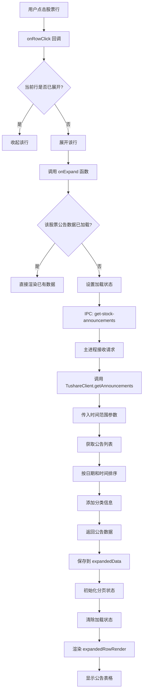

### 实现类映射表

| 流程节点 | 实现类/组件 | 文件路径 | 职责说明 |
|---------|-----------|---------|---------|
| 行点击事件 | `onRowClick` | `src/components/AnnouncementList.tsx` | 行点击回调 |
| 展开逻辑 | `onExpand` | `src/components/AnnouncementList.tsx` | 展开行处理函数 |
| 展开数据管理 | `expandedData` state | `src/components/AnnouncementList.tsx` | 展开行数据状态 |
| IPC 调用 | `window.electronAPI.getStockAnnouncements` | `src/electron.d.ts` | 获取单只股票公告 |
| IPC Handler | `get-stock-announcements` | `electron/ipc/announcement.ts` | IPC 处理器 |
| API 调用 | `TushareClient.getAnnouncements` | `electron/tushare.ts` | API 请求 |
| 分类服务 | `classificationService.classifyAnnouncementTitle` | `electron/services/classification.ts` | 公告分类 |
| 展开内容渲染 | `expandedRowRender` | `src/components/AnnouncementList.tsx` | 展开行渲染函数 |

---

## 5. 公告分类筛选流程

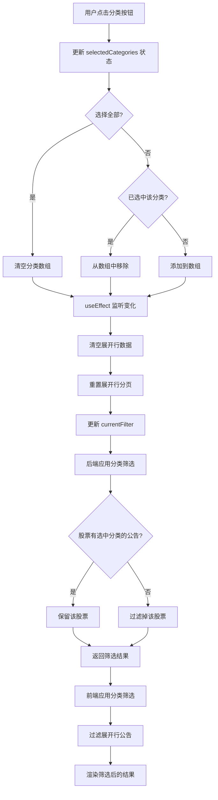

### 实现类映射表

| 流程节点 | 实现类/组件 | 文件路径 | 职责说明 |
|---------|-----------|---------|---------|
| 分类按钮 | `Button` (Ant Design) | `src/components/AnnouncementList.tsx` | 分类筛选按钮 |
| 分类状态 | `selectedCategories` state | `src/components/AnnouncementList.tsx` | 选中分类状态 |
| 分类定义 | `AnnouncementCategory` | `src/utils/announcementClassifier.ts` | 分类枚举定义 |
| 后端筛选 | `getAnnouncementsGroupedFromAPI` | `electron/services/announcement.ts` | 后端分类筛选逻辑 |
| 前端筛选 | `expandedRowRender` | `src/components/AnnouncementList.tsx` | 展开行分类筛选 |
| 分类工具 | `classifyAnnouncement` | `electron/utils/announcementClassifier.ts` | 分类算法 |

---

## 6. 市值筛选流程

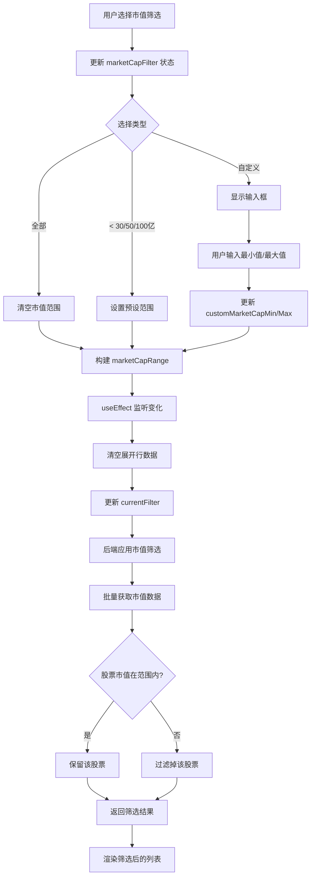

### 实现类映射表

| 流程节点 | 实现类/组件 | 文件路径 | 职责说明 |
|---------|-----------|---------|---------|
| 市值选择器 | `Select` (Ant Design) | `src/components/AnnouncementList.tsx` | 市值筛选下拉框 |
| 自定义输入 | `InputNumber` (Ant Design) | `src/components/AnnouncementList.tsx` | 自定义市值输入 |
| 市值状态 | `marketCapFilter` state | `src/components/AnnouncementList.tsx` | 市值筛选状态 |
| 市值数据获取 | `StockDetailRepository.batchGetLatestMarketValues` | `electron/repositories/implementations/StockDetailRepository.ts` | 批量获取市值 |
| 市值筛选逻辑 | `getAnnouncementsGroupedFromAPI` | `electron/services/announcement.ts` | 市值范围筛选 |

---

## 7. 关注股票筛选流程

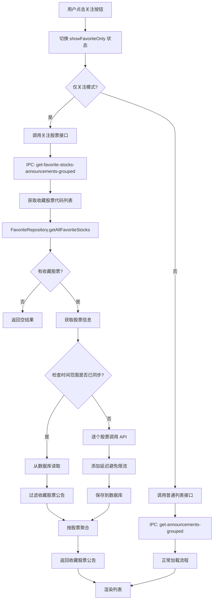

### 实现类映射表

| 流程节点 | 实现类/组件 | 文件路径 | 职责说明 |
|---------|-----------|---------|---------|
| 关注按钮 | `Button` (Ant Design) | `src/components/AnnouncementList.tsx` | 关注筛选按钮 |
| 关注状态 | `showFavoriteOnly` state | `src/components/AnnouncementList.tsx` | 关注筛选状态 |
| 关注切换 | `handleToggleFavoriteFilter` | `src/components/AnnouncementList.tsx` | 切换关注筛选 |
| IPC 调用 | `get-favorite-stocks-announcements-grouped` | `electron/ipc/announcement.ts` | 关注股票 IPC |
| 业务逻辑 | `getFavoriteStocksAnnouncementsGroupedFromAPI` | `electron/services/announcement.ts` | 关注股票业务逻辑 |
| 收藏仓储 | `FavoriteRepository.getAllFavoriteStocks` | `electron/repositories/implementations/FavoriteRepository.ts` | 获取收藏列表 |

---

## 8. PDF 预览流程

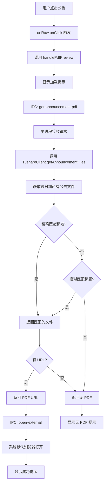

### 实现类映射表

| 流程节点 | 实现类/组件 | 文件路径 | 职责说明 |
|---------|-----------|---------|---------|
| 点击事件 | `onRow` | `src/components/AnnouncementList.tsx` | 表格行点击事件 |
| PDF 处理 | `handlePdfPreview` | `src/components/AnnouncementList.tsx` | PDF 预览处理函数 |
| IPC 调用 | `window.electronAPI.getAnnouncementPdf` | `src/electron.d.ts` | 获取 PDF IPC |
| IPC Handler | `get-announcement-pdf` | `electron/ipc/announcement.ts` | PDF IPC 处理器 |
| API 调用 | `TushareClient.getAnnouncementFiles` | `electron/tushare.ts` | 获取公告文件 |
| 外部打开 | `window.electronAPI.openExternal` | `src/electron.d.ts` | 打开外部链接 |
| 系统 IPC | `open-external` | `electron/ipc/system.ts` | 系统功能 IPC |

---

## 9. 时间范围快速选择流程

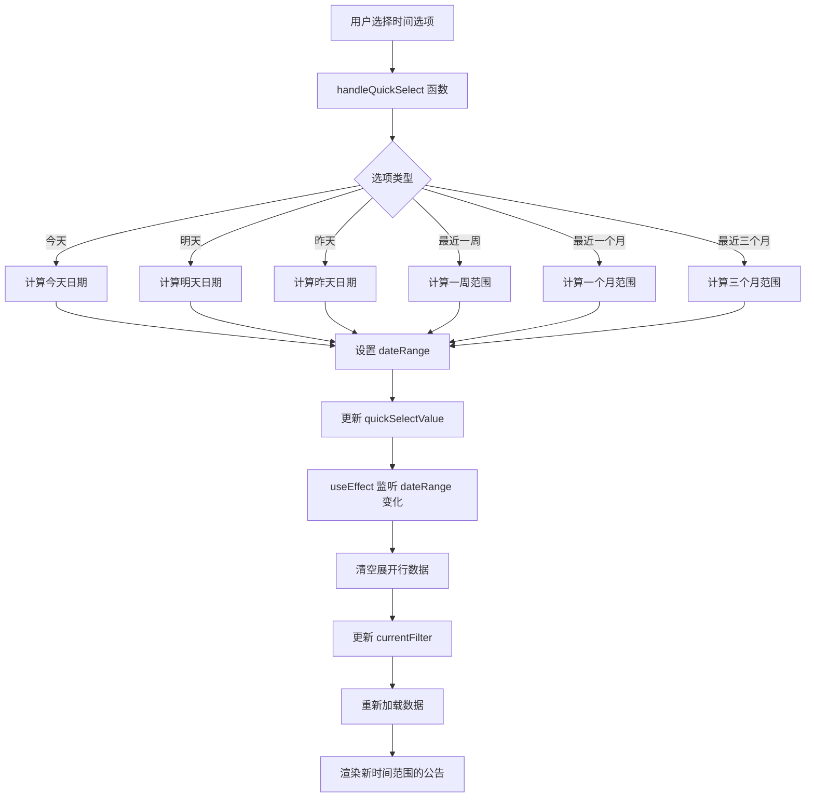

### 实现类映射表

| 流程节点 | 实现类/组件 | 文件路径 | 职责说明 |
|---------|-----------|---------|---------|
| 时间选择器 | `Select` (Ant Design) | `src/components/AnnouncementList.tsx` | 时间快速选择 |
| 时间处理 | `handleQuickSelect` | `src/hooks/useStockFilter.ts` | 快速选择处理 |
| 时间状态 | `dateRange` state | `src/hooks/useStockFilter.ts` | 时间范围状态 |
| 筛选器 Hook | `useStockFilter` | `src/hooks/useStockFilter.ts` | 筛选条件管理 |

---

## 10. 刷新数据流程

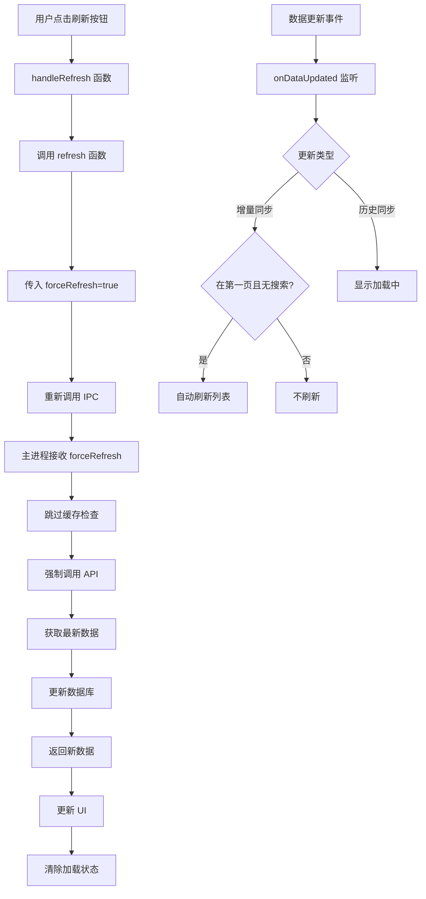

### 实现类映射表

| 流程节点 | 实现类/组件 | 文件路径 | 职责说明 |
|---------|-----------|---------|---------|
| 刷新按钮 | `Button` (Ant Design) | `src/components/AnnouncementList.tsx` | 刷新按钮 |
| 刷新处理 | `handleRefresh` | `src/components/AnnouncementList.tsx` | 刷新处理函数 |
| 数据刷新 | `refresh` | `src/hooks/useStockList.ts` | 数据刷新逻辑 |
| 数据更新监听 | `onDataUpdated` | `src/components/AnnouncementList.tsx` | 数据更新监听 |
| IPC 事件 | `window.electronAPI.onDataUpdated` | `src/electron.d.ts` | 数据更新事件 |

---

## 11. 分页处理流程

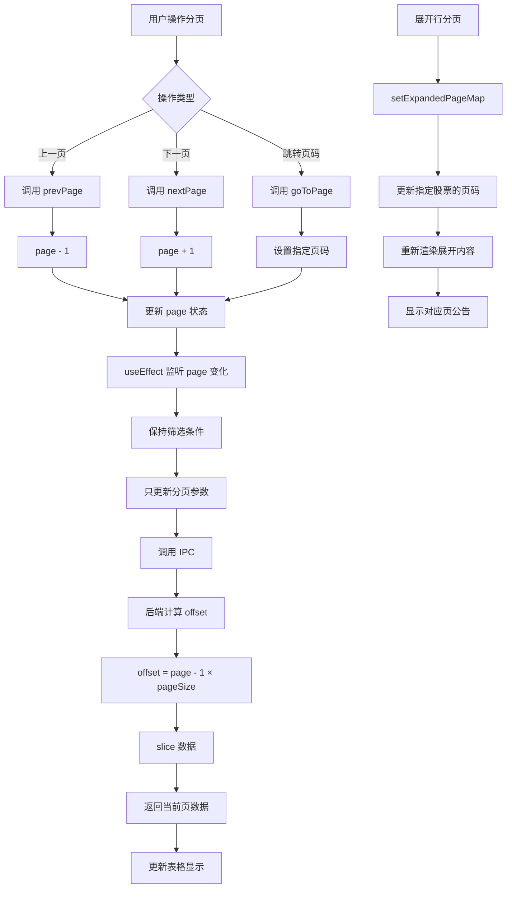

### 实现类映射表

| 流程节点 | 实现类/组件 | 文件路径 | 职责说明 |
|---------|-----------|---------|---------|
| 主列表分页 | `page` state | `src/hooks/useStockList.ts` | 主列表分页状态 |
| 上一页 | `prevPage` | `src/hooks/useStockList.ts` | 上一页函数 |
| 下一页 | `nextPage` | `src/hooks/useStockList.ts` | 下一页函数 |
| 跳转页 | `goToPage` | `src/hooks/useStockList.ts` | 跳转页函数 |
| 展开行分页 | `expandedPageMap` state | `src/components/AnnouncementList.tsx` | 展开行分页映射 |
| 分页组件 | `Pagination` (Ant Design) | `src/components/AnnouncementList.tsx` | 分页 UI 组件 |

---

## 12. 数据同步与缓存流程

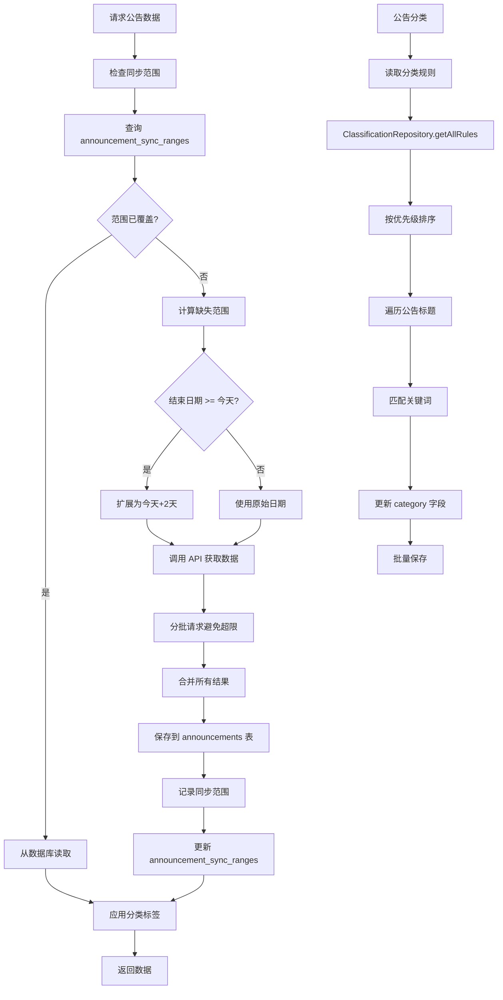

### 实现类映射表

| 流程节点 | 实现类/组件 | 文件路径 | 职责说明 |
|---------|-----------|---------|---------|
| 同步范围检查 | `isAnnouncementRangeSynced` | `electron/repositories/implementations/AnnouncementRepository.ts` | 检查范围是否已同步 |
| 同步范围表 | `announcement_sync_ranges` | `electron/database/migrations.ts` | 数据库表 |
| 日期调整 | `adjustEndDateForFutureAnnouncements` | `electron/services/announcement.ts` | 日期范围调整 |
| API 调用 | `TushareClient.getAnnouncementsComplete` | `electron/tushare.ts` | 完整获取公告 |
| 数据保存 | `upsertAnnouncements` | `electron/repositories/implementations/AnnouncementRepository.ts` | 批量保存公告 |
| 记录同步范围 | `recordAnnouncementSyncRange` | `electron/repositories/implementations/AnnouncementRepository.ts` | 记录已同步范围 |
| 分类规则 | `getAllRules` | `electron/repositories/implementations/ClassificationRepository.ts` | 获取分类规则 |
| 批量分类 | `tagAnnouncementsBatch` | `electron/repositories/implementations/AnnouncementRepository.ts` | 批量标记分类 |

---

## 13. 筛选条件联动流程

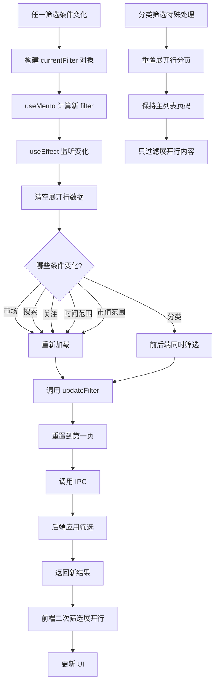

### 实现类映射表

| 流程节点 | 实现类/组件 | 文件路径 | 职责说明 |
|---------|-----------|---------|---------|
| 筛选条件构建 | `currentFilter` useMemo | `src/components/AnnouncementList.tsx` | 筛选条件计算 |
| 筛选监听 | `useEffect` | `src/components/AnnouncementList.tsx` | 监听筛选变化 |
| 筛选更新 | `updateFilter` | `src/hooks/useStockList.ts` | 更新筛选条件 |
| 筛选器 Hook | `useStockFilter` | `src/hooks/useStockFilter.ts` | 筛选状态管理 |
| 后端筛选 | `getAnnouncementsGroupedFromAPI` | `electron/services/announcement.ts` | 后端筛选逻辑 |

---

## 总结

### 核心类关系

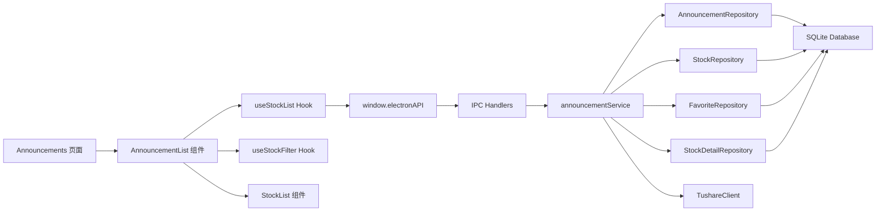

### 数据流向

1. **用户交互** → **React 组件** → **Hooks** → **IPC** → **主进程服务** → **Repository** → **数据库/API**
2. **数据返回** → **Service 聚合** → **IPC 返回** → **Hook 更新状态** → **组件重渲染**

### 关键特性

- **防抖搜索**: 避免频繁请求
- **数据缓存**: 减少 API 调用
- **智能同步**: 自动管理同步范围
- **分页加载**: 提升性能
- **分类筛选**: 灵活的多维度筛选
- **搜索历史**: 提升用户体验

