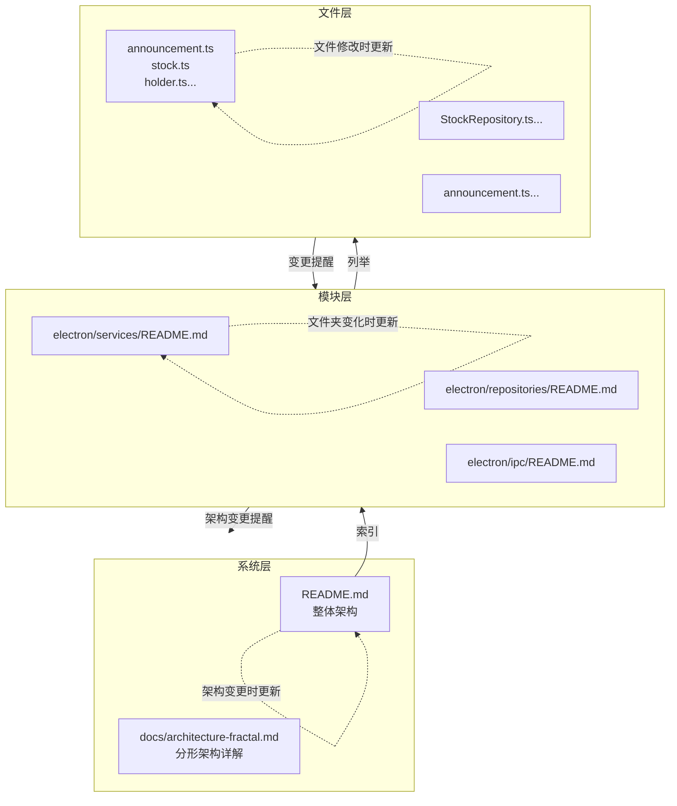
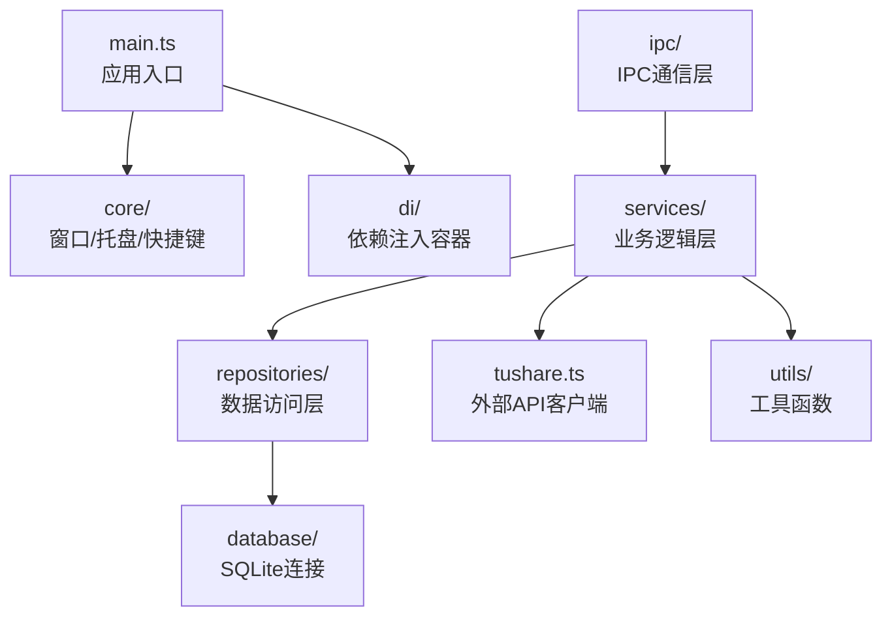
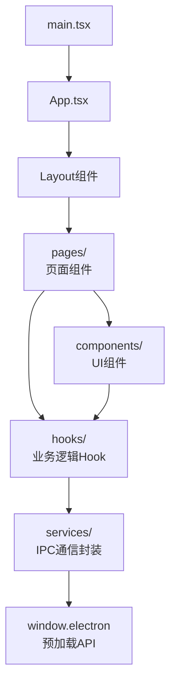
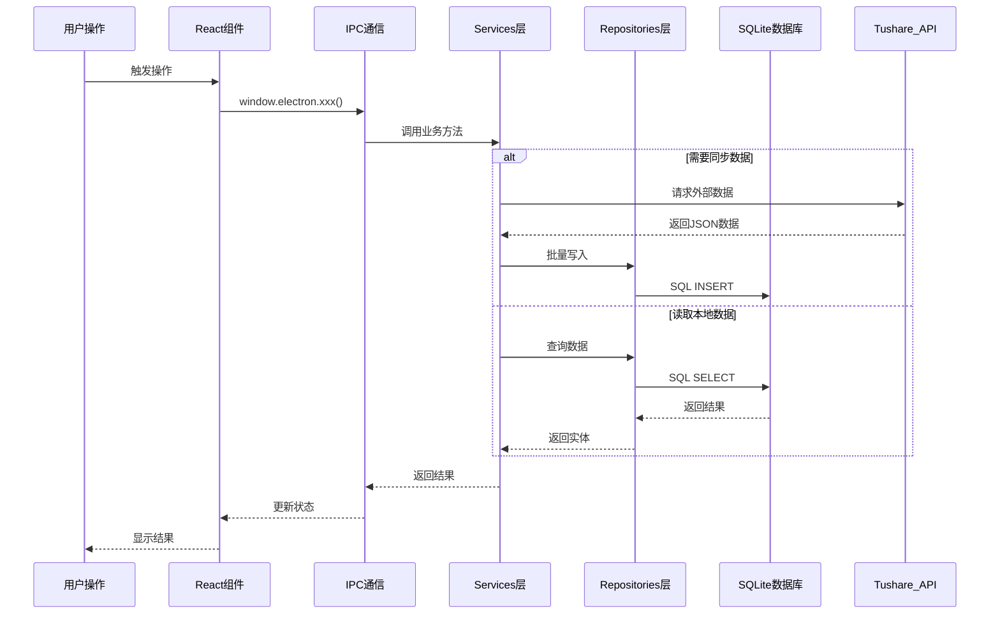

# CafeStock 分形架构文档

⚠️ **自指声明**：本文档是系统架构的最高层描述。任何模块架构变更都应同步更新本文档。

---

## 架构哲学

本项目采用分形文档结构，每个层级都包含"我是谁、我从哪来、我到哪去"的完整信息：



---

## 三层架构概览

### Electron 主进程架构



**核心模块文档**：

-   [`electron/services/`](../electron/services/README.md) - 业务逻辑层 ✅ 已实施分形结构
-   [`electron/repositories/`](../electron/repositories/README.md) - 数据访问层 ✅ 已实施分形结构
-   [`electron/ipc/`](../electron/ipc/README.md) - IPC 通信层 ✅ 已实施分形结构

### React 渲染进程架构



**核心模块文档**：

-   [`src/components/`](../src/components/README.md) - UI 组件层 ✅ 已实施分形结构
-   [`src/hooks/`](../src/hooks/README.md) - Hook 层 ✅ 已实施分形结构
-   [`src/pages/`](../src/pages/README.md) - 页面层 ✅ 已实施分形结构

---

## 数据流全景



---

## 模块详解

### 业务逻辑层（Services）

**文档入口**：[`electron/services/README.md`](../electron/services/README.md)

**核心职责**：

-   封装业务逻辑，协调外部 API 与数据层
-   提供给 IPC 层调用的业务方法
-   管理数据同步的时机和策略

**关键服务**：

-   announcement.ts - 公告同步与智能分类
-   stock.ts - 股票数据同步协调
-   holder.ts - 股东信息同步
-   favorite.ts - 用户收藏管理
-   stock-detail-sync.ts - 底层同步引擎

---

### 数据访问层（Repositories）

**文档入口**：[`electron/repositories/README.md`](../electron/repositories/README.md)

**核心职责**：

-   封装数据库操作，提供统一的数据访问接口
-   实现 Repository 模式，隔离业务逻辑与数据持久化
-   提供事务管理和批量操作支持

**关键 Repository**：

-   StockRepository - 股票基础数据访问
-   AnnouncementRepository - 公告数据访问
-   HolderRepository - 股东数据访问
-   FavoriteRepository - 收藏数据访问
-   StockDetailRepository - 股票详情数据访问
-   ClassificationRepository - 分类规则数据访问

---

### IPC 通信层

**文档入口**：[`electron/ipc/README.md`](../electron/ipc/README.md)

**核心职责**：

-   定义主进程与渲染进程的通信协议
-   实现 IPC 处理器，调用服务层方法
-   提供错误处理和参数验证

**关键处理器**：

-   announcement.ts - 公告相关 IPC
-   stock.ts - 股票相关 IPC
-   holder.ts - 股东相关 IPC
-   favorite.ts - 收藏相关 IPC
-   database.ts - 数据库管理 IPC
-   system.ts - 系统功能 IPC
-   updater.ts - 自动更新 IPC
-   classification.ts - 分类规则 IPC

---

### 依赖注入容器（DI）

**核心职责**：

-   管理服务实例的生命周期
-   实现依赖注入，解耦模块间依赖
-   提供服务注册和解析机制

**关键文件**：

-   container.ts - IoC 容器实现
-   serviceRegistry.ts - 服务注册表

---

### 外部 API 客户端（Tushare）

**核心职责**：

-   封装 Tushare API 调用
-   处理 API 限流和重试逻辑
-   提供统一的错误处理

**关键方法**：

-   getAnnouncements() - 获取公告数据
-   getStockList() - 获取股票列表
-   getStockDaily() - 获取日线数据
-   getTop10Holders() - 获取十大股东

---

## 渲染进程架构详解

### 页面层（Pages）

**核心页面**：

-   Announcements.tsx - 公告浏览页
-   DataInsights.tsx - 数据洞察页
-   Settings.tsx - 设置页

### 组件层（Components）

**核心组件**：

-   AnnouncementList.tsx - 公告列表组件
-   StockList - 股票列表组件
-   PDFViewer.tsx - PDF 查看器
-   UpdateChecker.tsx - 更新检查器

### Hook 层（Hooks）

**核心 Hook**：

-   useStockList.ts - 股票列表数据管理
-   useFavoriteStocks.ts - 收藏股票管理
-   useStockFilter.ts - 股票筛选逻辑

---

## 数据库架构

### 核心表结构

**stocks** - 股票基础信息

-   ts_code (主键) - 股票代码
-   name - 股票名称
-   market - 市场类型
-   list_date - 上市日期

**announcements** - 公告数据

-   id (主键) - 自增 ID
-   ts_code - 股票代码
-   ann_date - 公告日期
-   title - 公告标题
-   pdf_url - PDF 链接

**holders** - 股东数据

-   id (主键) - 自增 ID
-   ts_code - 股票代码
-   end_date - 截止日期
-   holder_name - 股东名称

**favorites** - 用户收藏

-   ts_code (主键) - 股票代码
-   created_at - 创建时间

---

## 分形文档结构示意

### 文件层注释示例

每个源文件开头包含三行注释：

```typescript
/**
 * INPUT: [依赖的外部模块/API/数据源]
 * OUTPUT: [对外提供的函数/类/接口]
 * POS: [在系统中的角色定位]
 *
 * ⚠️ 更新提醒：修改此文件后，请同步更新：
 *    1. 本文件开头的 INPUT/OUTPUT/POS 注释
 *    2. 所在目录的 README.md 中的文件列表
 *    3. 如影响架构，更新根目录文档
 */
```

### 目录层 README 示例

每个代码目录包含 README.md：

```markdown
# 模块名称

**架构定位（3 行）**:

-   职责：[模块的核心职责]
-   依赖：[依赖的其他模块]
-   输出：[对外提供的能力]

⚠️ **自指声明**：一旦本文件夹有文件新增/删除/重命名，请立即更新本 README

## 文件清单

[列出所有文件及其功能说明]
```

### 系统层文档示例

根目录和 docs/ 目录的文档描述整体架构和模块关系。

---

## 扩展指南

### 为新模块添加分形结构

1. **为每个文件添加注释头**

    - 使用标准的 INPUT/OUTPUT/POS 格式
    - 添加更新提醒

2. **创建目录级 README.md**

    - 包含架构定位（3 行）
    - 列出所有文件及功能
    - 添加自指声明
    - 使用 Mermaid 图表说明依赖关系

3. **更新上层文档**

    - 更新根目录 README.md 的模块导航
    - 更新本文档的模块详解章节

4. **运行验证工具**
    - 使用 `node scripts/validate-fractal-docs.cjs` 检查完整性

---

## 维护原则

### 局部影响整体

当你修改一个文件时：

1. 更新文件开头的注释（文件层）
2. 更新所在目录的 README.md（目录层）
3. 如影响架构，更新本文档（系统层）

### 整体影响局部

当架构发生变化时：

1. 更新本文档（系统层）
2. 更新受影响模块的 README.md（目录层）
3. 更新受影响文件的注释（文件层）

### 自指与递归

每个层级都包含"更新我"的提醒，形成自指循环：

-   文件提醒：我变了，更新目录文档
-   目录提醒：我变了，更新系统文档
-   系统提醒：我变了，检查所有模块

---

## 后续推广计划

### 第二批（Q1）✅ 已完成

-   ✅ electron/repositories/ - 数据访问层
-   ✅ electron/ipc/ - IPC 通信层

### 第三批（Q2）✅ 已完成

-   ✅ src/components/ - UI 组件层
-   ✅ src/hooks/ - Hook 层
-   ✅ src/pages/ - 页面层

### 完整覆盖（Q3）

-   全项目所有代码目录
-   完善验证工具
-   集成 CI/CD 检查

---

**文档版本**：v1.2  
**最后更新**：2025-12-26  
**维护者**：开发团队  
**已实施模块**：

-   ✅ electron/services/ - 业务逻辑层
-   ✅ electron/repositories/ - 数据访问层
-   ✅ electron/ipc/ - IPC 通信层
-   ✅ src/components/ - UI 组件层
-   ✅ src/hooks/ - Hook 层
-   ✅ src/pages/ - 页面层
