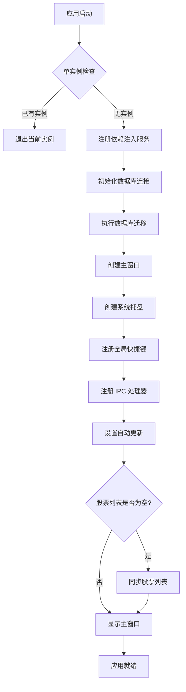
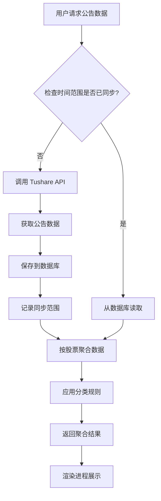
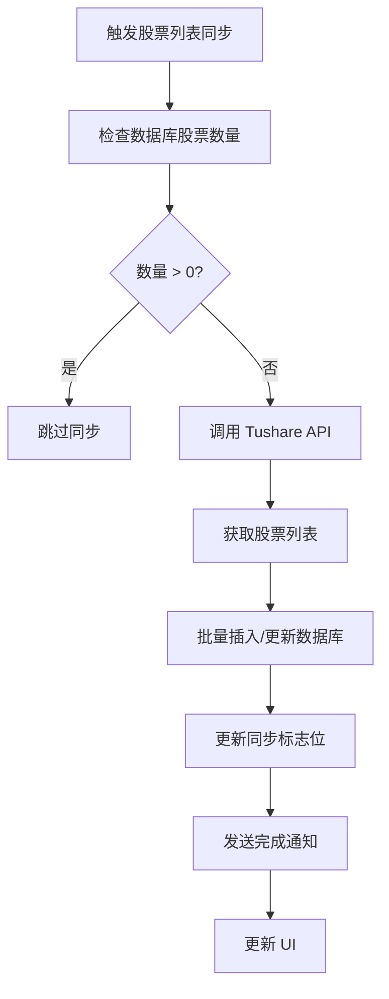
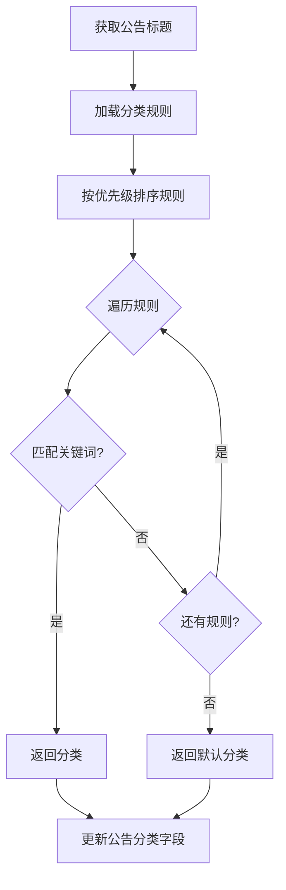
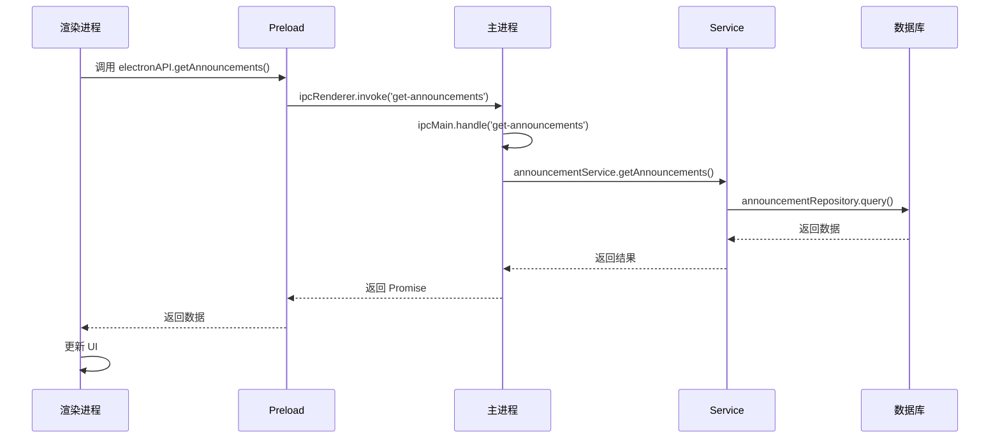
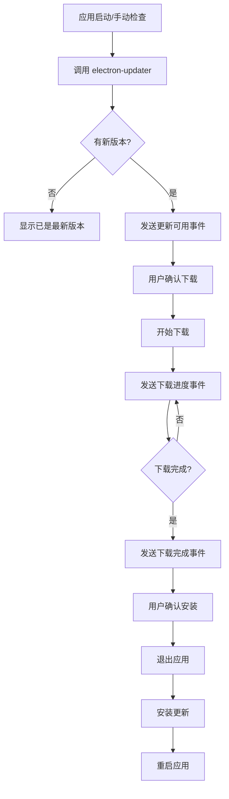
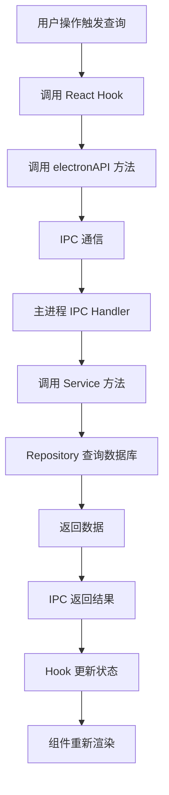

# CafeStock (酷咖啡股票助手) 技术架构文档

## 1. 项目概述

CafeStock 是一个基于 Electron + React + TypeScript 的桌面应用程序，用于浏览和管理 A 股市场公告。采用**主进程同步 + 本地数据库 + 渲染进程展示**的架构模式，实现离线快速浏览和智能数据同步。

## 2. 整体架构

### 2.1 架构分层

```
┌─────────────────────────────────────────────────────────┐
│                    渲染进程 (Renderer)                   │
│  React + TypeScript + Ant Design + TailwindCSS          │
│  - 纯展示层，不直接请求外部 API                          │
│  - 通过 IPC 与主进程通信                                 │
└────────────────────┬────────────────────────────────────┘
                     │ IPC (Inter-Process Communication)
┌────────────────────┴────────────────────────────────────┐
│                    主进程 (Main Process)                  │
│  Electron + Node.js + TypeScript                         │
│  - 数据同步逻辑                                          │
│  - 数据库操作                                            │
│  - Tushare API 调用                                      │
│  - IPC 处理器                                            │
└────────────────────┬────────────────────────────────────┘
                     │
┌────────────────────┴────────────────────────────────────┐
│                    数据层 (Data Layer)                    │
│  SQLite (better-sqlite3)                                 │
│  - 本地数据存储                                          │
│  - 数据持久化                                            │
└──────────────────────────────────────────────────────────┘
```

### 2.2 核心设计模式

-   **依赖注入 (DI)**: 使用自定义 DI 容器管理服务和仓储
-   **仓储模式 (Repository Pattern)**: 数据访问层抽象
-   **服务层 (Service Layer)**: 业务逻辑封装
-   **IPC 通信**: 主进程与渲染进程安全通信

## 3. 核心模块说明

### 3.1 主进程入口 (`electron/main.ts`)

**功能**: 应用生命周期管理和模块初始化

**核心职责**:

-   应用启动和关闭管理
-   单实例锁定（确保只运行一个实例）
-   模块初始化协调
-   全局异常处理

**关键流程**:

1. 检查单实例锁定
2. 注册依赖注入服务
3. 创建主窗口
4. 创建系统托盘
5. 注册全局快捷键
6. 注册 IPC 处理器
7. 设置自动更新
8. 启动时同步股票列表（如需要）

### 3.2 窗口管理 (`electron/core/window.ts`)

**功能**: 主窗口创建和状态管理

**核心类**: `createWindow()`, `getMainWindow()`, `setMainWindow()`

**特性**:

-   窗口状态持久化（使用 `electron-window-state`）
-   内容安全策略 (CSP) 配置
-   开发工具自动打开（开发环境）
-   窗口关闭行为（隐藏而非退出）

### 3.3 系统托盘 (`electron/core/tray.ts`)

**功能**: 系统托盘图标和菜单管理

**特性**:

-   托盘图标显示
-   右键菜单（显示/退出）
-   点击图标显示/隐藏窗口

### 3.4 数据库连接 (`electron/database/connection.ts`)

**功能**: SQLite 数据库连接管理

**核心类**: `initializeDatabase()`, `getDatabase()`, `closeDatabase()`

**特性**:

-   单例模式（全局唯一数据库实例）
-   WAL 模式（提高并发性能）
-   性能优化配置（缓存大小、同步模式等）
-   数据库路径管理（用户数据目录）

**性能配置**:

-   `journal_mode = WAL`: 写前日志模式
-   `synchronous = NORMAL`: 正常同步模式
-   `cache_size = -64000`: 64MB 缓存
-   `temp_store = MEMORY`: 临时表存储在内存

### 3.5 数据库迁移 (`electron/database/migrations.ts`)

**功能**: 数据库表结构创建和迁移

**核心表结构**:

-   `stocks`: 股票基本信息
-   `announcements`: 公告数据
-   `top10_holders`: 十大股东数据
-   `stock_daily_basic`: 股票日线基础数据
-   `stock_company`: 公司信息
-   `sync_flags`: 同步标志位
-   `announcement_sync_ranges`: 公告同步范围记录
-   `classification_categories`: 分类类别
-   `classification_rules`: 分类规则

### 3.6 依赖注入容器 (`electron/di/container.ts`)

**功能**: 服务依赖管理

**核心类**: `DIContainer`

**特性**:

-   服务注册（工厂函数或实例）
-   单例模式支持
-   服务解析和缓存
-   服务查询和清空

**使用方式**:

```typescript
// 注册服务
container.register<IStockRepository>(
	SERVICE_KEYS.STOCK_REPOSITORY,
	() => new StockRepository(db),
	true // 单例
);

// 解析服务
const repo = container.resolve<IStockRepository>(SERVICE_KEYS.STOCK_REPOSITORY);
```

### 3.7 服务注册 (`electron/di/serviceRegistry.ts`)

**功能**: 统一注册所有服务和仓储

**已注册服务**:

-   `StockRepository`: 股票仓储
-   `FavoriteRepository`: 收藏仓储
-   `AnnouncementRepository`: 公告仓储
-   `HolderRepository`: 股东仓储
-   `ClassificationRepository`: 分类仓储

### 3.8 Tushare API 客户端 (`electron/tushare.ts`)

**功能**: Tushare Pro API 调用封装

**核心类**: `TushareClient`

**主要方法**:

-   `getStockList()`: 获取股票列表
-   `getAnnouncements()`: 获取公告数据
-   `getAnnouncementsComplete()`: 完整获取公告（支持大范围日期）
-   `getDailyBasic()`: 获取日线基础数据
-   `getStockCompany()`: 获取公司信息
-   `getTop10Holders()`: 获取十大股东
-   `getNews()`: 获取财经资讯

**特性**:

-   统一的请求/响应处理
-   详细的日志记录
-   错误处理和重试机制
-   数据格式转换（数组转对象）

### 3.9 仓储层 (Repository Layer)

#### 3.9.1 基础仓储 (`electron/repositories/base/BaseRepository.ts`)

**功能**: 提供通用数据库操作方法

**核心方法**:

-   `transaction()`: 事务处理
-   `getCurrentTimestamp()`: 获取当前时间戳
-   `execute()`: 执行 SQL

#### 3.9.2 股票仓储 (`electron/repositories/implementations/StockRepository.ts`)

**接口**: `IStockRepository`

**核心方法**:

-   `upsertStocks()`: 批量插入或更新股票
-   `getAllStocks()`: 获取所有股票
-   `countStocks()`: 统计股票数量
-   `searchStocks()`: 搜索股票（名称、代码、拼音）

#### 3.9.3 公告仓储 (`electron/repositories/implementations/AnnouncementRepository.ts`)

**接口**: `IAnnouncementRepository`

**核心方法**:

-   `upsertAnnouncements()`: 批量插入或更新公告
-   `getAnnouncementsByDateRange()`: 按日期范围查询公告
-   `isAnnouncementRangeSynced()`: 检查时间范围是否已同步
-   `recordAnnouncementSyncRange()`: 记录同步范围
-   `searchAnnouncements()`: 搜索公告

#### 3.9.4 收藏仓储 (`electron/repositories/implementations/FavoriteRepository.ts`)

**接口**: `IFavoriteRepository`

**核心方法**:

-   `addFavorite()`: 添加收藏
-   `removeFavorite()`: 移除收藏
-   `isFavorite()`: 检查是否收藏
-   `getAllFavoriteStocks()`: 获取所有收藏股票

#### 3.9.5 股东仓储 (`electron/repositories/implementations/HolderRepository.ts`)

**接口**: `IHolderRepository`

**核心方法**:

-   `upsertHolders()`: 批量插入或更新股东数据
-   `getHoldersByStock()`: 获取股票的股东数据
-   `getHoldersByEndDate()`: 按报告期获取股东数据

#### 3.9.6 分类仓储 (`electron/repositories/implementations/ClassificationRepository.ts`)

**接口**: `IClassificationRepository`

**核心方法**:

-   `getCategories()`: 获取所有分类
-   `getRules()`: 获取分类规则
-   `addRule()`: 添加规则
-   `updateRule()`: 更新规则
-   `deleteRule()`: 删除规则

### 3.10 服务层 (Service Layer)

#### 3.10.1 股票服务 (`electron/services/stock.ts`)

**功能**: 股票列表同步和管理

**核心方法**:

-   `syncStocksIfNeeded()`: 按需同步股票列表（首次启动）
-   `syncAllStocks()`: 同步所有股票列表
-   `syncStockDetails()`: 同步股票详情（市值+公司信息）
-   `getStockList()`: 获取股票列表
-   `getStockCount()`: 获取股票数量

**同步策略**:

-   启动时检查，如数据库为空则自动同步
-   支持进度回调
-   批量处理（100 只/批）
-   API 限流控制（批次间延迟）

#### 3.10.2 公告服务 (`electron/services/announcement.ts`)

**功能**: 公告数据获取、聚合和搜索

**核心方法**:

-   `getAnnouncementsGroupedFromAPI()`: 获取聚合公告（按股票分组）
-   `searchAnnouncementsGroupedFromAPI()`: 搜索聚合公告
-   `getFavoriteStocksAnnouncementsGroupedFromAPI()`: 获取关注股票公告

**聚合逻辑**:

-   按股票代码分组
-   计算分类统计
-   按最新公告日期排序
-   支持分页

**缓存策略**:

-   检查时间范围是否已同步
-   已同步则从数据库读取
-   未同步则从 API 获取并保存

#### 3.10.3 收藏服务 (`electron/services/favorite.ts`)

**功能**: 股票收藏管理

**核心方法**:

-   `addFavoriteStock()`: 添加收藏
-   `removeFavoriteStock()`: 移除收藏
-   `isFavoriteStock()`: 检查是否收藏
-   `getAllFavoriteStocks()`: 获取所有收藏

#### 3.10.4 股东服务 (`electron/services/holder.ts`)

**功能**: 十大股东数据同步和管理

**核心方法**:

-   `syncAllTop10Holders()`: 同步所有股票的十大股东
-   `syncStockTop10Holders()`: 同步单个股票的十大股东
-   `getTop10Holders()`: 获取股东数据

**同步特性**:

-   支持暂停/恢复
-   支持停止
-   进度回调
-   批量处理

#### 3.10.5 分类服务 (`electron/services/classification.ts`)

**功能**: 公告分类和规则管理

**核心方法**:

-   `classifyAnnouncementTitle()`: 分类公告标题
-   `getCategories()`: 获取分类列表
-   `getRules()`: 获取规则列表
-   `tagAllAnnouncements()`: 批量打标所有公告

**分类规则**:

-   基于关键词匹配
-   支持优先级
-   支持启用/禁用

#### 3.10.6 资讯服务 (`electron/services/news.ts`)

**功能**: 财经资讯获取

**核心方法**:

-   `getNews()`: 获取资讯列表

**特性**:

-   支持多新闻源（新浪、华尔街见闻等）
-   支持日期范围筛选
-   实时获取（不缓存）

### 3.11 IPC 通信层 (`electron/ipc/`)

**功能**: 主进程与渲染进程通信桥接

**IPC 处理器模块**:

-   `system.ts`: 系统相关（通知、版本等）
-   `updater.ts`: 自动更新相关
-   `stock.ts`: 股票相关
-   `announcement.ts`: 公告相关
-   `favorite.ts`: 收藏相关
-   `holder.ts`: 股东相关
-   `classification.ts`: 分类相关
-   `news.ts`: 资讯相关
-   `database.ts`: 数据库相关

**通信方式**:

-   `ipcMain.handle()`: 处理渲染进程请求
-   `ipcMain.on()`: 监听渲染进程事件
-   `webContents.send()`: 向渲染进程发送事件

### 3.12 Preload 脚本 (`electron/preload.ts`)

**功能**: 安全暴露 Electron API 到渲染进程

**特性**:

-   使用 `contextBridge` 安全暴露 API
-   类型安全的 IPC 调用封装
-   事件监听器管理

**暴露的 API**:

-   `electronAPI.getAnnouncements()`: 获取公告
-   `electronAPI.addFavoriteStock()`: 添加收藏
-   `electronAPI.searchStocks()`: 搜索股票
-   `electronAPI.checkForUpdates()`: 检查更新
-   等等...

### 3.13 自动更新 (`electron/updater/index.ts`)

**功能**: 应用自动更新管理

**特性**:

-   启动时自动检查更新
-   手动检查更新
-   后台下载
-   下载进度显示
-   一键安装

**更新源**: GitHub Releases

### 3.14 公告分类器 (`electron/utils/announcementClassifier.ts`)

**功能**: 公告标题智能分类

**分类类别**:

-   财务报告
-   重大事项
-   股权变动
-   业绩预告
-   风险提示
-   其他

**分类方式**:

-   基于关键词匹配
-   支持规则优先级
-   支持自定义规则

### 3.15 日志工具 (`electron/utils/logger.ts`)

**功能**: 统一日志管理

**日志级别**:

-   `debug`: 调试信息
-   `info`: 一般信息
-   `warn`: 警告信息
-   `error`: 错误信息

**特性**:

-   统一格式
-   模块标识
-   时间戳

## 4. 渲染进程架构

### 4.1 应用入口 (`src/App.tsx`)

**功能**: React 应用根组件

**特性**:

-   React Router 路由配置
-   Ant Design App 组件包装
-   股票列表同步状态管理

### 4.2 页面组件 (`src/pages/`)

-   `Announcements.tsx`: 公告列表页面
-   `News.tsx`: 资讯页面
-   `DataInsights.tsx`: 数据洞察页面
-   `Settings.tsx`: 设置页面

### 4.3 业务组件 (`src/components/`)

-   `AnnouncementList.tsx`: 公告列表组件
-   `NewsList.tsx`: 资讯列表组件
-   `StockList/`: 股票列表组件
-   `FavoriteButton.tsx`: 收藏按钮组件
-   `PDFViewer.tsx`: PDF 查看器组件

### 4.4 自定义 Hooks (`src/hooks/`)

-   `useStockList.ts`: 股票列表管理
-   `useFavoriteStocks.ts`: 收藏股票管理
-   `useStockSearch.ts`: 股票搜索
-   `useStockFilter.ts`: 股票过滤

### 4.5 服务层 (`src/services/`)

-   `stockService.ts`: 股票服务（渲染进程）
-   `favoriteStockService.ts`: 收藏服务（渲染进程）
-   `stockListSync.ts`: 股票列表同步服务

## 5. 核心功能流程图

### 5.1 应用启动流程



### 5.2 公告数据同步流程



### 5.3 股票列表同步流程



### 5.4 公告分类流程



### 5.5 IPC 通信流程



### 5.6 自动更新流程



### 5.7 数据查询流程（渲染进程）



## 6. 数据流

### 6.1 数据同步流

```
Tushare API → Service Layer → Repository Layer → SQLite Database
```

### 6.2 数据查询流

```
React Component → Hook → electronAPI → IPC → Service → Repository → Database
```

### 6.3 数据展示流

```
Database → Repository → Service → IPC → electronAPI → Hook → React Component → UI
```

## 7. 关键技术特性

### 7.1 性能优化

1. **数据库优化**:

    - WAL 模式提高并发性能
    - 索引优化查询速度
    - 批量操作减少 I/O

2. **数据缓存**:

    - 本地 SQLite 数据库缓存
    - 同步范围记录避免重复请求
    - 增量同步减少数据传输

3. **API 限流**:
    - 批次间延迟控制
    - 批量查询减少请求次数

### 7.2 安全性

1. **IPC 安全**:

    - Context Isolation 启用
    - Node Integration 禁用
    - 使用 contextBridge 安全暴露 API

2. **内容安全策略**:
    - CSP 限制资源加载
    - 仅允许白名单域名

### 7.3 可维护性

1. **代码组织**:

    - 清晰的分层架构
    - 依赖注入解耦
    - 接口抽象便于测试

2. **类型安全**:

    - TypeScript 全面覆盖
    - 接口定义规范

3. **日志系统**:
    - 统一日志格式
    - 模块化日志标识
    - 多级别日志支持

## 8. 扩展性设计

### 8.1 新增数据源

1. 实现新的 API 客户端
2. 创建对应的 Service
3. 创建对应的 Repository
4. 注册 IPC Handler

### 8.2 新增功能模块

1. 创建 Service 接口和实现
2. 创建 Repository 接口和实现
3. 注册到 DI 容器
4. 添加 IPC Handler
5. 在 Preload 中暴露 API
6. 创建前端组件和 Hook

## 9. 总结

CafeStock 采用现代化的 Electron 应用架构，通过清晰的分层设计、依赖注入模式和仓储模式，实现了高内聚、低耦合的代码结构。主进程负责数据同步和业务逻辑，渲染进程专注于 UI 展示，通过 IPC 安全通信，确保了应用的稳定性和安全性。

