# CafeStock 核心功能流程图

本文档包含 CafeStock 项目的核心功能流程图，使用 Mermaid 语法绘制。

## 1. 应用启动流程

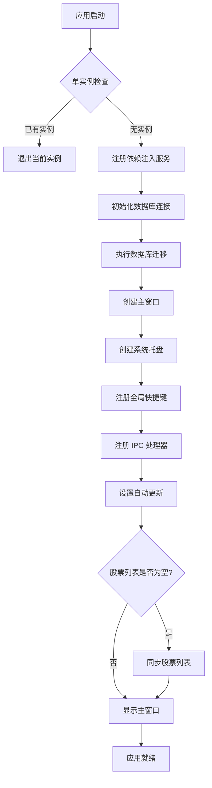

## 2. 公告数据同步流程

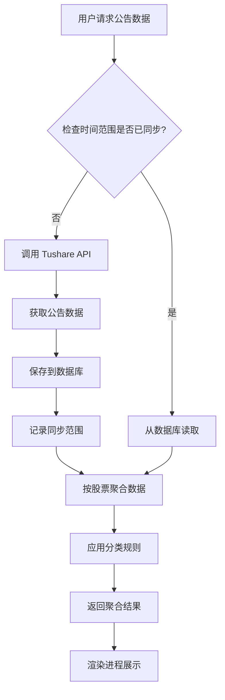

## 3. 股票列表同步流程

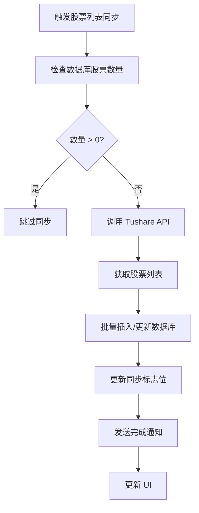

## 4. 公告分类流程

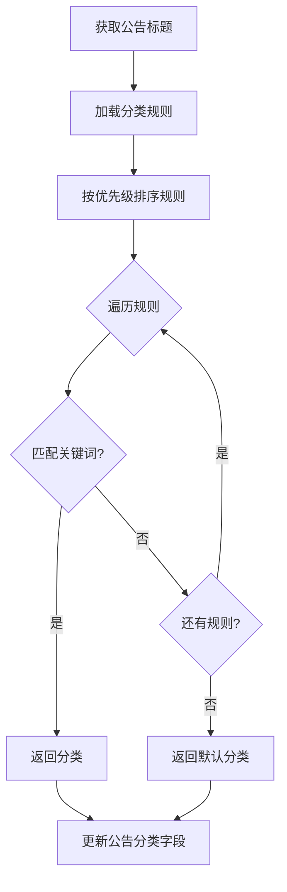

## 5. IPC 通信流程

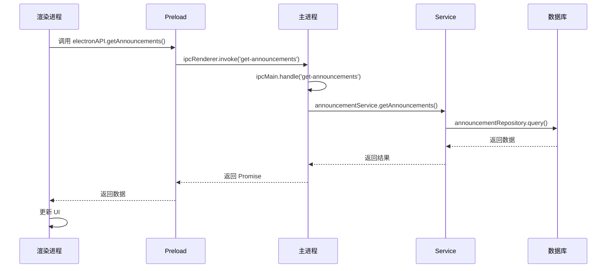

## 6. 自动更新流程

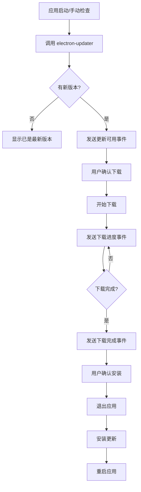

## 7. 数据查询流程（渲染进程）

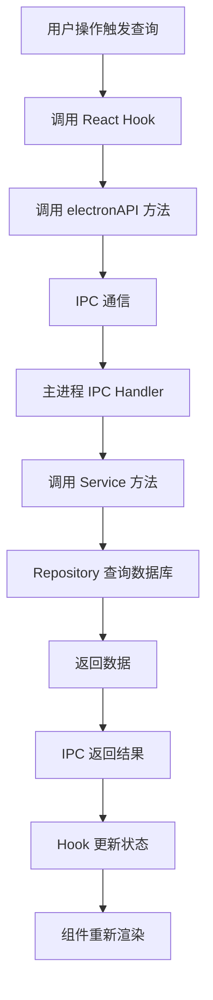

## 8. 股票详情同步流程

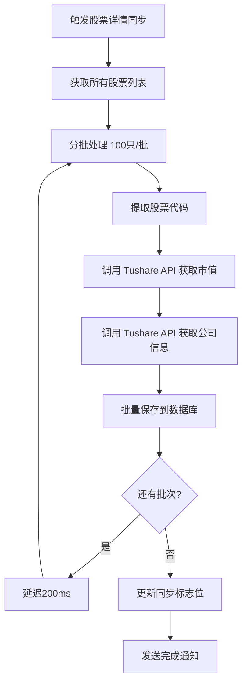

## 9. 十大股东同步流程

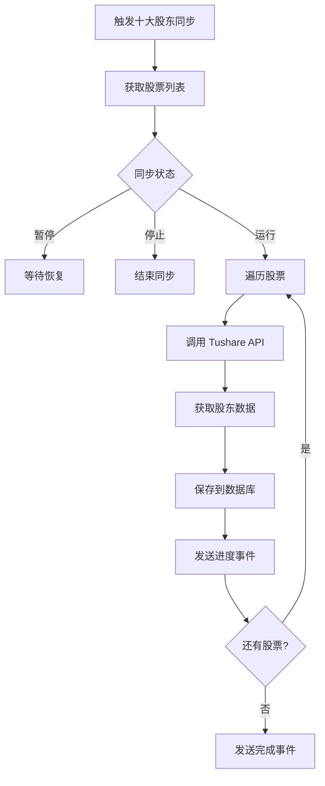

## 10. 公告搜索流程

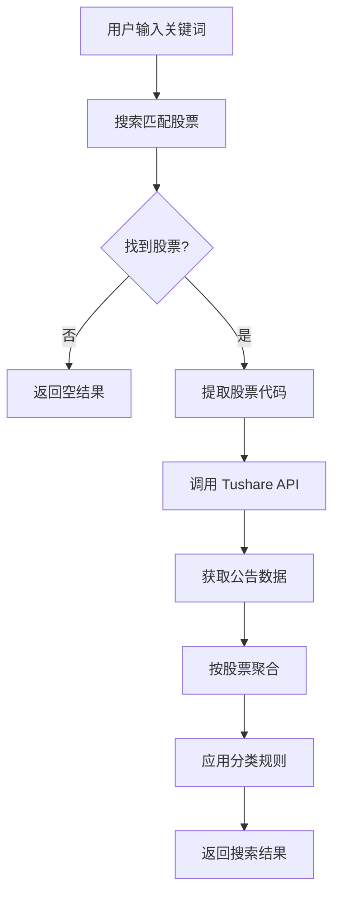

## 11. 收藏股票管理流程

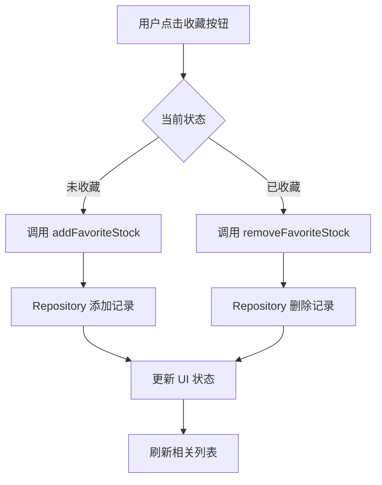

## 12. 数据库连接管理流程

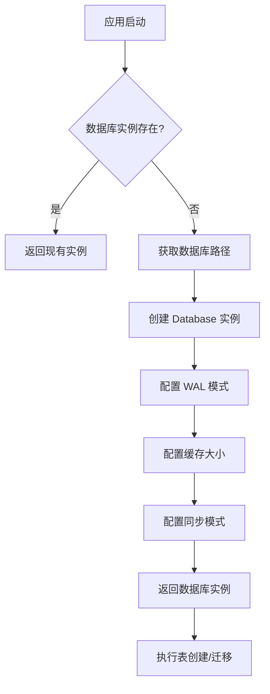

## 13. 依赖注入服务解析流程

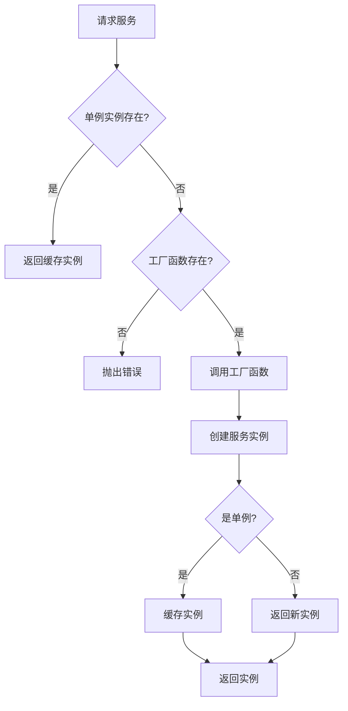

## 14. 窗口生命周期流程

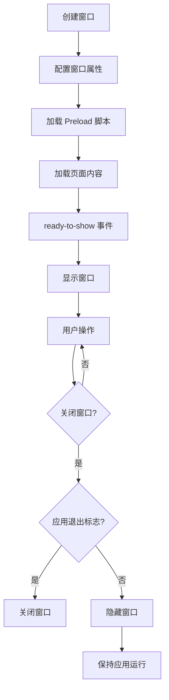

## 15. 系统托盘交互流程

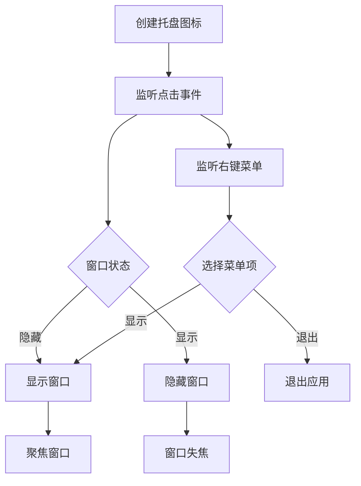

## 16. 公告聚合算法流程

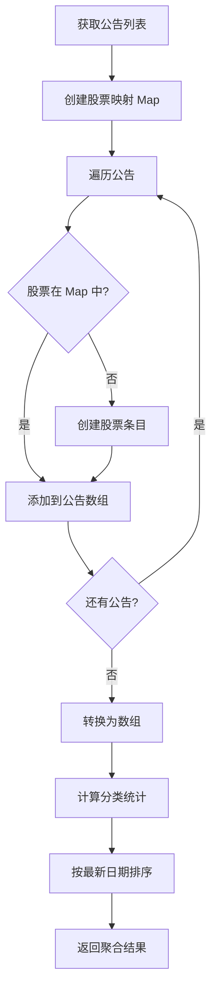

## 17. 错误处理流程

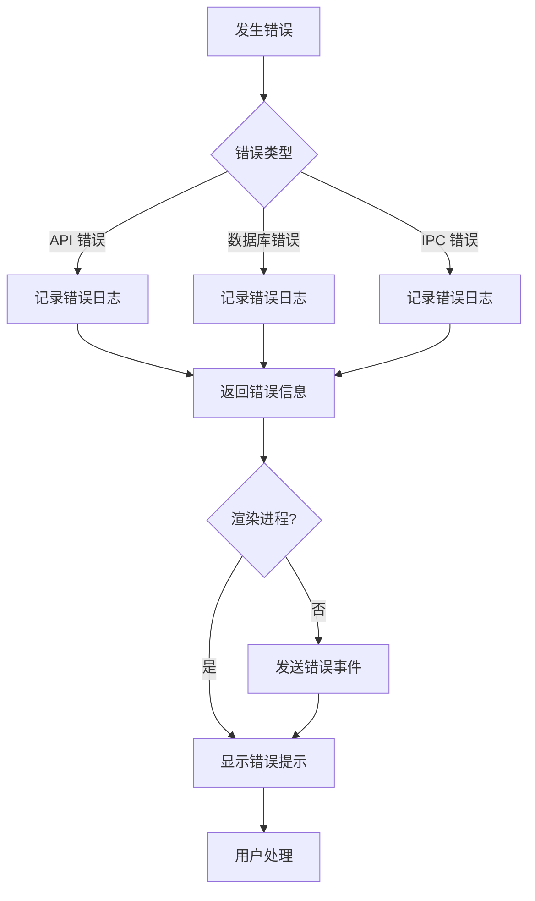

## 18. 数据同步范围检查流程

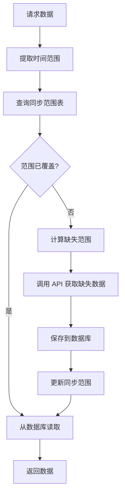

## 19. 批量数据处理流程

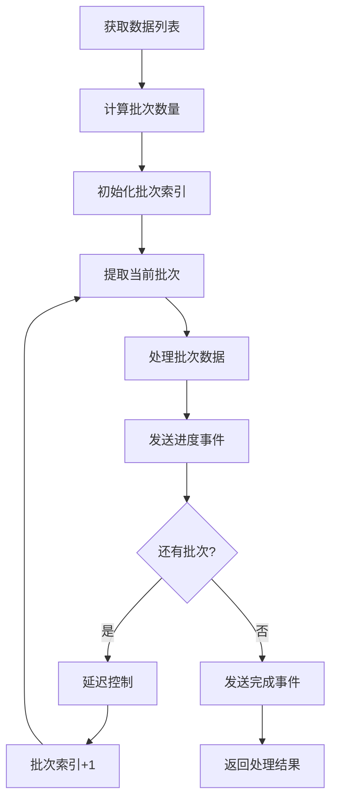

## 20. 分类规则匹配流程

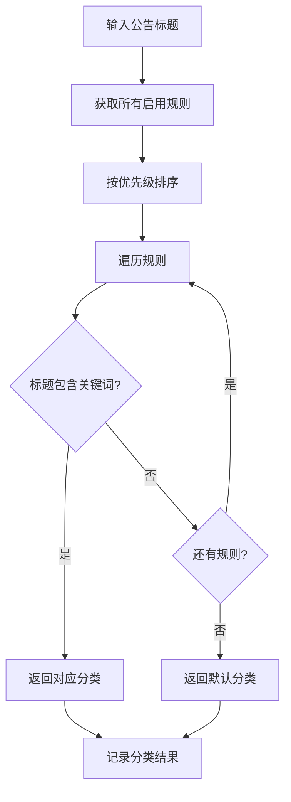
