# CafeStock 分形架构完整文档

⚠️ **自指声明**：本文档汇总了所有分形文档，提供系统架构的完整视图。任何模块架构变更都应同步更新对应的模块文档和本文档。

**生成时间**: 2025-12-27

---

## 目录

- [架构哲学](#架构哲学)
- [整体架构](#整体架构)
- [Electron 主进程](#electron-主进程)
  - [Services 层](#services-层)
  - [Repositories 层](#repositories-层)
  - [IPC 通信层](#ipc-通信层)
- [React 渲染进程](#react-渲染进程)
  - [Pages 层](#pages-层)
  - [Components 层](#components-层)
  - [Hooks 层](#hooks-层)
  - [Services 层](#services-层-1)
  - [Types 层](#types-层)
  - [Utils 层](#utils-层)
- [维护原则](#维护原则)

---

## 架构哲学

本项目采用分形文档结构，每个层级都包含"依赖、输出和职责"的完整信息：

### 分形文档结构示意

#### 文件层注释示例

每个源文件开头包含三行注释：

```typescript
/**
 * 依赖: [依赖的外部模块/API/数据源]
 * 输出: [对外提供的函数/类/接口]
 * 职责: [在系统中的角色定位]
 *
 * ⚠️ 更新提醒：修改此文件后，请同步更新：
 *    1. 本文件开头的 INPUT/OUTPUT/POS 注释
 *    2. 所在目录的 README.md 中的文件列表
 *    3. 如影响架构，更新根目录文档
 */
```

#### 目录层 README 示例

每个代码目录包含 README.md：

```markdown
# 模块名称

**架构定位（3 行）**:

-   职责：[模块的核心职责]
-   依赖：[依赖的其他模块]
-   输出：[对外提供的能力]

⚠️ **自指声明**：一旦本文件夹有文件新增/删除/重命名，请立即更新本 README

## 文件清单

[列出所有文件及其功能说明]
```

#### 系统层文档示例

根目录和 docs/ 目录的文档描述整体架构和模块关系。

---

## 整体架构

### 系统架构图

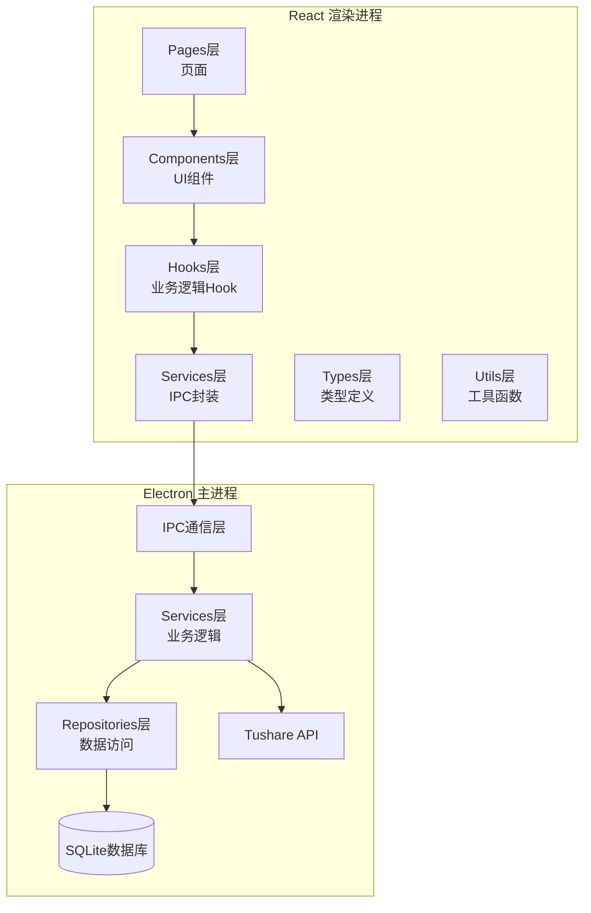

### 数据流架构

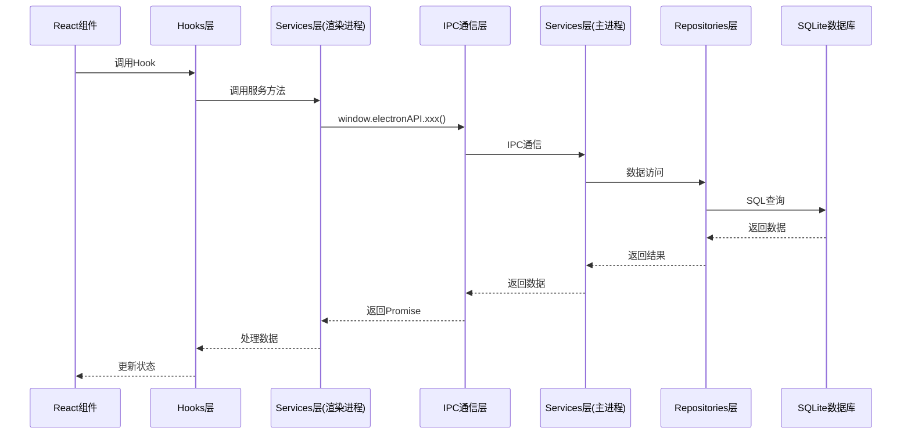

---

## Electron 主进程

### Services 层

**架构定位（3行）**:
- 职责：封装业务逻辑，协调外部API与数据持久层，提供IPC调用接口
- 依赖：repositories（数据访问）、tushare（外部API）、database（连接管理）
- 输出：向 ipc/ 层提供可调用的业务方法，是主进程的业务逻辑中枢

#### 数据流架构

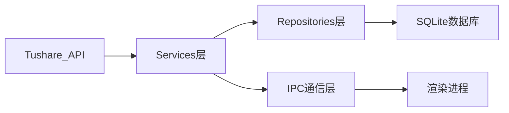

#### 核心服务实现

**announcement.ts**
- **地位**：公告业务核心服务
- **功能**：同步公告数据、智能分类（重要/财报/重组等）、PDF下载管理、聚合查询
- **关键依赖**：TushareClient, AnnouncementRepository, announcementClassifier
- **对外接口**：syncAnnouncements(), getGroupedAnnouncements()

**stock.ts**
- **地位**：股票数据服务核心
- **功能**：股票列表同步、详情数据同步、增量更新协调
- **关键依赖**：TushareClient, StockRepository, StockDetailRepository
- **对外接口**：syncStocksIfNeeded(), syncAllStocks()

**holder.ts**
- **地位**：股东信息服务
- **功能**：前十大股东、流通股东数据同步，支持增量更新
- **关键依赖**：TushareClient, HolderRepository
- **对外接口**：syncAllTop10Holders(), pauseSync(), resumeSync(), stopSync()

**favorite.ts**
- **地位**：用户收藏服务
- **功能**：股票收藏的增删改查业务逻辑
- **关键依赖**：FavoriteRepository
- **对外接口**：addFavoriteStock(), removeFavoriteStock(), getAllFavoriteStocks()

**classification.ts**
- **地位**：分类规则服务
- **功能**：公告智能分类逻辑管理
- **关键依赖**：announcementClassifier
- **对外接口**：classifyAnnouncementTitle(), classifyAnnouncementsBatch()

**stock-detail-sync.ts**
- **地位**：低级别同步引擎
- **功能**：股票详情增量同步、断点续传、进度管理
- **关键依赖**：TushareClient, StockDetailRepository, syncFlagManager
- **对外接口**：syncStockDetailsWithResume(), getStockDetailsSyncProgress()

#### 服务间依赖关系

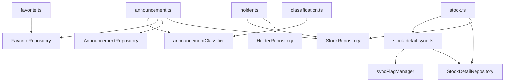

---

### Repositories 层

**架构定位（3行）**:

-   职责：封装数据库操作，实现Repository模式，隔离业务逻辑与数据持久化
-   依赖：database（SQLite连接）、types（实体类型定义）
-   输出：向 services/ 层提供数据访问接口，实现数据访问的抽象和复用

#### 数据流架构

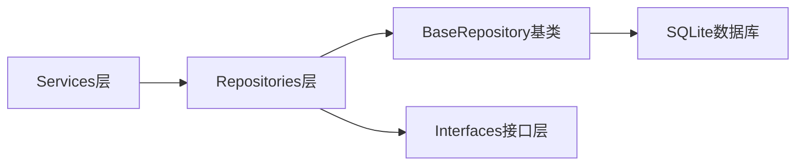

#### 设计模式

本层采用 **Repository 模式**，实现以下目标：

-   **数据访问抽象**：将数据访问逻辑从业务逻辑中分离
-   **接口隔离**：通过接口定义契约，实现依赖倒置
-   **代码复用**：BaseRepository 提供通用功能，减少重复代码
-   **易于测试**：接口定义便于 Mock 和单元测试

#### Repository实现

**StockRepository.ts**
-   **地位**：股票数据访问实现
-   **功能**：股票表的CRUD操作、搜索、统计
-   **关键方法**：
    -   `upsertStocks()` - 批量插入或更新股票
    -   `getAllStocks()` - 获取所有股票
    -   `searchStocks()` - 关键词搜索
    -   `countStocks()` - 统计股票数量

**AnnouncementRepository.ts**
-   **地位**：公告数据访问实现
-   **功能**：公告表的CRUD操作、智能分类、聚合查询
-   **关键方法**：
    -   `upsertAnnouncements()` - 批量插入或更新公告（自动分类）
    -   `getAnnouncementsByStock()` - 按股票查询公告
    -   `getAnnouncementsByDateRange()` - 按日期范围查询
    -   `getGroupedAnnouncements()` - 聚合查询（按股票分组）

**HolderRepository.ts**
-   **地位**：股东数据访问实现
-   **功能**：十大股东表的CRUD操作、查询
-   **关键方法**：
    -   `upsertTop10Holders()` - 批量插入或更新股东数据
    -   `getTop10HoldersByStock()` - 按股票查询股东
    -   `getTop10HoldersEndDates()` - 获取报告期列表

**FavoriteRepository.ts**
-   **地位**：收藏数据访问实现
-   **功能**：收藏表的CRUD操作
-   **关键方法**：
    -   `addFavoriteStock()` - 添加收藏
    -   `removeFavoriteStock()` - 移除收藏
    -   `getAllFavoriteStocks()` - 获取所有收藏
    -   `isFavoriteStock()` - 检查是否收藏

**StockDetailRepository.ts**
-   **地位**：股票详情数据访问实现
-   **功能**：股票日线指标和公司信息的CRUD操作
-   **关键方法**：
    -   `upsertDailyBasic()` - 批量插入或更新日线指标
    -   `upsertCompanyInfo()` - 批量插入或更新公司信息
    -   `getDailyBasicByCode()` - 获取最新市值数据
    -   `getLatestMarketValue()` - 获取最新市值（用于列表展示）

**ClassificationRepository.ts**
-   **地位**：分类规则数据访问实现
-   **功能**：分类规则表的CRUD操作
-   **关键方法**：
    -   `getClassificationCategories()` - 获取所有分类
    -   `getClassificationRules()` - 获取所有规则
    -   `updateRule()` - 更新分类规则
    -   `createCategory()` - 创建新分类

#### Repository间依赖关系

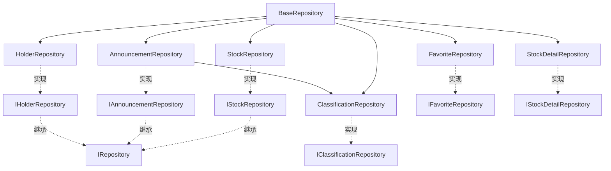

#### 数据库表映射

| Repository              | 数据库表              | 主要字段                          |
| ----------------------- | --------------------- | --------------------------------- |
| StockRepository         | stocks                | ts_code, name, market, list_date   |
| AnnouncementRepository | announcements         | ts_code, ann_date, title, category |
| HolderRepository        | top10_holders         | ts_code, end_date, holder_name    |
| FavoriteRepository      | favorites             | ts_code, created_at               |
| StockDetailRepository   | stock_daily_basic     | ts_code, trade_date, total_mv     |
| StockDetailRepository   | company_info          | ts_code, company_name, industry   |
| ClassificationRepository| classification_rules  | category_key, pattern, priority   |

---

### IPC 通信层

**架构定位（3行）**:

-   职责：定义主进程与渲染进程的通信协议，实现IPC处理器，调用服务层方法
-   依赖：services（业务逻辑层）、repositories（数据访问层）、Electron IPC API
-   输出：向渲染进程提供可调用的IPC接口，是主进程与渲染进程的桥梁

#### 通信架构

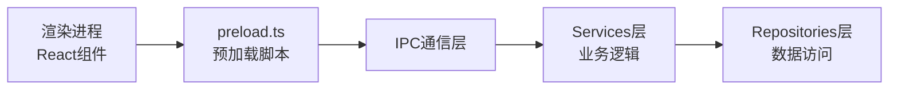

#### IPC 通信流程

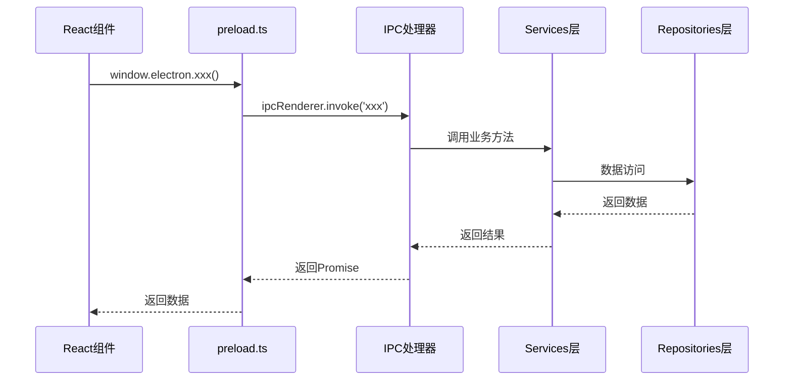

#### 核心处理器

**announcement.ts**
-   **地位**：公告业务IPC处理器
-   **功能**：处理公告相关的IPC调用（获取、同步、搜索、PDF下载）
-   **关键IPC通道**：
    -   `get-announcements` - 获取公告列表
    -   `sync-announcements` - 同步公告数据
    -   `search-announcements` - 搜索公告
    -   `get-announcement-pdf` - 获取PDF文件

**stock.ts**
-   **地位**：股票业务IPC处理器
-   **功能**：处理股票相关的IPC调用（列表、同步、详情）
-   **关键IPC通道**：
    -   `get-all-stocks` - 获取所有股票
    -   `sync-stocks` - 同步股票列表
    -   `get-stock-details` - 获取股票详情
    -   `get-stock-sync-progress` - 获取同步进度

**holder.ts**
-   **地位**：股东业务IPC处理器
-   **功能**：处理股东相关的IPC调用（查询、同步）
-   **关键IPC通道**：
    -   `get-top10-holders` - 获取十大股东
    -   `sync-holders` - 同步股东数据
    -   `pause-holder-sync` / `resume-holder-sync` - 控制同步

**favorite.ts**
-   **地位**：收藏业务IPC处理器
-   **功能**：处理收藏相关的IPC调用（增删查）
-   **关键IPC通道**：
    -   `add-favorite-stock` - 添加收藏
    -   `remove-favorite-stock` - 移除收藏
    -   `get-all-favorite-stocks` - 获取所有收藏

**classification.ts**
-   **地位**：分类规则IPC处理器
-   **功能**：处理分类规则相关的IPC调用（CRUD）
-   **关键IPC通道**：
    -   `get-classification-categories` - 获取所有分类
    -   `get-classification-rules` - 获取所有规则
    -   `update-classification-rule` - 更新规则

**database.ts**
-   **地位**：数据库管理IPC处理器
-   **功能**：处理数据库管理相关的IPC调用（连接信息、导出、HTTP服务）
-   **关键IPC通道**：
    -   `get-db-connection-info` - 获取数据库连接信息
    -   `export-db` - 导出数据库
    -   `start-sqlite-http-server` - 启动HTTP服务
    -   `get-column-widths` / `save-column-widths` - 列宽配置

**system.ts**
-   **地位**：系统功能IPC处理器
-   **功能**：处理系统级功能的IPC调用（通知、版本、外部链接）
-   **关键IPC通道**：
    -   `show-notification` - 显示系统通知
    -   `get-app-version` - 获取应用版本
    -   `open-external` - 打开外部链接

**updater.ts**
-   **地位**：自动更新IPC处理器
-   **功能**：处理自动更新相关的IPC调用（检查、下载、安装）
-   **关键IPC通道**：
    -   `check-for-updates` - 检查更新
    -   `download-update` - 下载更新
    -   `install-update` - 安装更新

**index.ts**
-   **地位**：IPC处理器聚合入口
-   **功能**：统一注册所有IPC处理器
-   **关键函数**：
    -   `setupIPC()` - 注册所有IPC处理器的主入口

#### IPC通道清单

| 模块 | IPC通道数量 | 主要功能 |
|------|------------|---------|
| announcement.ts | 4 | 公告获取、同步、搜索、PDF下载 |
| stock.ts | 4 | 股票列表、同步、详情、进度 |
| holder.ts | 4 | 股东查询、同步、控制 |
| favorite.ts | 3 | 收藏增删查 |
| classification.ts | 3 | 分类规则管理 |
| database.ts | 5 | 数据库管理、导出、HTTP服务 |
| system.ts | 3 | 系统通知、版本、外部链接 |
| updater.ts | 3 | 自动更新 |
| **总计** | **29** | - |

---

## React 渲染进程

### Pages 层

**架构定位（3行）**:

-   职责：定义应用的路由页面，组合components和hooks，形成完整的页面功能
-   依赖：components(UI组件)、hooks(业务逻辑)、react-router-dom(路由)
-   输出：向路由系统提供页面组件，是用户访问的功能入口

#### 页面架构

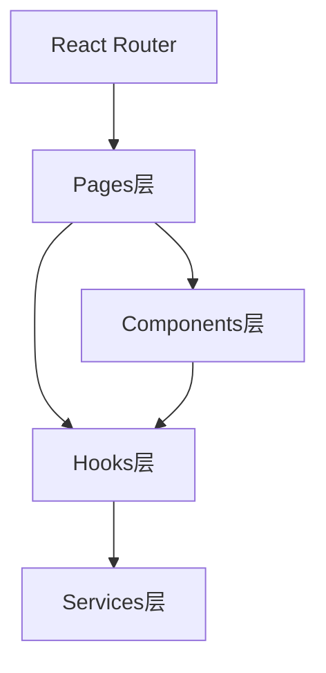

#### 页面清单

**Announcements.tsx**
-   **地位**：公告列表页面
-   **功能**：公告功能的主入口页面
-   **关键依赖**：AnnouncementList组件
-   **路由路径**：`/announcements`
-   **主要特性**：
    -   公告列表展示
    -   搜索和筛选
    -   PDF查看和下载

**DataInsights.tsx**
-   **地位**：数据洞察页面
-   **功能**：数据分析和洞察功能的主界面
-   **关键依赖**：window.electronAPI, Ant Design组件
-   **路由路径**：`/data-insights`
-   **主要特性**：
    -   股东数据同步
    -   同步进度展示
    -   数据统计展示
    -   十大股东查询

**Settings.tsx**
-   **地位**：设置页面
-   **功能**：应用设置和配置管理的主界面
-   **关键依赖**：ClassificationRuleEditor, window.electronAPI
-   **路由路径**：`/settings`
-   **主要特性**：
    -   分类规则管理
    -   数据库管理
    -   应用配置
    -   自动更新设置

---

### Components 层

**架构定位（3行）**:

-   职责：封装可复用的UI组件，提供用户界面展示和交互功能
-   依赖：Ant Design(UI库)、hooks(业务逻辑)、services(IPC通信封装)、types(类型定义)
-   输出：向pages层提供可复用的UI组件，是渲染进程的UI构建基础

#### 组件架构

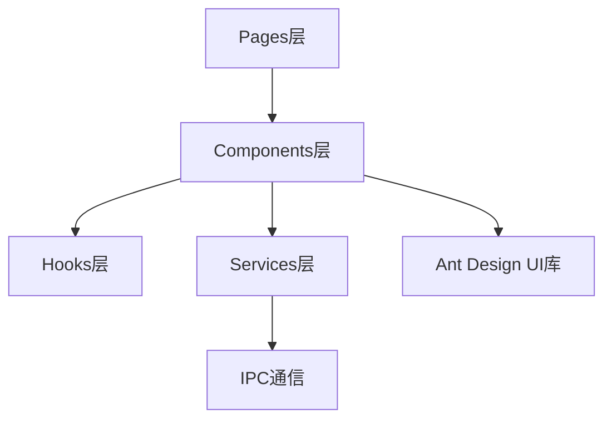

#### 核心业务组件

**AnnouncementList.tsx**
-   **地位**：公告列表核心组件
-   **功能**：公告数据的展示、搜索、筛选、分页、PDF查看
-   **关键依赖**：useStockList, useStockFilter, StockList, announcementClassifier
-   **主要特性**：
    -   支持关键词搜索和搜索历史
    -   支持按市场、日期范围、分类筛选
    -   支持分页浏览（每页200条）
    -   集成PDF查看和下载功能

**StockList/StockList.tsx**
-   **地位**：通用股票列表组件
-   **功能**：股票列表的通用展示，集成收藏功能
-   **关键依赖**：FavoriteButton, useStockList, announcementClassifier
-   **主要特性**：
    -   可调整列宽
    -   支持搜索和筛选
    -   集成收藏按钮
    -   显示最新市值和分类标签

**FavoriteButton.tsx**
-   **地位**：收藏按钮组件
-   **功能**：股票收藏/取消收藏的交互组件
-   **关键依赖**：useFavoriteStocks, window.electronAPI
-   **主要特性**：
    -   可复用的收藏按钮
    -   自动同步收藏状态
    -   提供操作反馈

#### 功能组件

**PDFViewer.tsx** - PDF查看器组件
**PDFWebViewer.tsx** - WebView版PDF查看器（备选方案）
**UpdateChecker.tsx** - 自动更新检查器组件
**ClassificationRuleEditor.tsx** - 分类规则编辑器组件
**StockListSyncIndicator.tsx** - 股票列表同步指示器组件
**CacheDataIndicator.tsx** - 缓存数据统计指示器组件

#### 布局组件

**Layout.tsx**
-   **地位**：应用主布局组件
-   **功能**：定义应用的整体结构（导航栏、侧边栏、内容区）
-   **关键依赖**：react-router-dom, CacheDataIndicator
-   **主要特性**：
    -   顶部导航菜单
    -   路由内容区域
    -   缓存数据指示器

#### 组件依赖关系

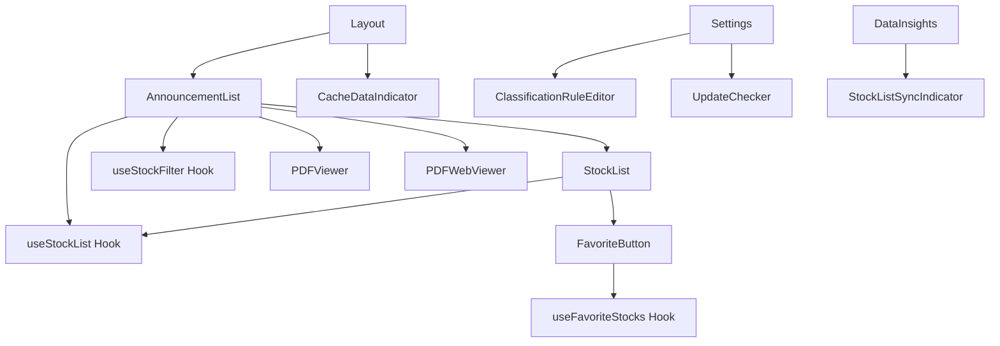

---

### Hooks 层

**架构定位（3行）**:

-   职责：封装业务逻辑的状态管理和数据获取，提供可复用的React Hook
-   依赖：services(IPC通信封装)、types(类型定义)、Ant Design(消息提示)
-   输出：向components层提供业务逻辑Hook，隔离UI与业务逻辑

#### Hook架构

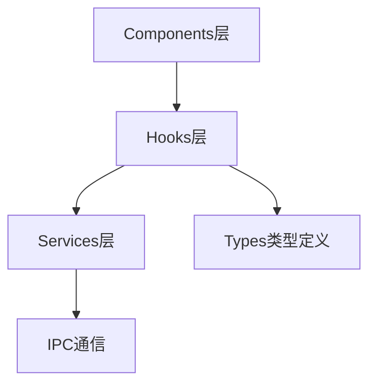

#### Hook清单

**useStockList.ts**
-   **地位**：股票列表数据获取Hook
-   **功能**：封装股票列表数据获取逻辑，统一的状态管理和错误处理
-   **关键依赖**：stockService, types, Ant Design App
-   **返回值**：
    -   `stocks` - 股票列表数据
    -   `loading` - 加载状态
    -   `error` - 错误信息
    -   `refresh()` - 刷新数据
    -   `setFilter()` - 设置筛选条件
    -   `setPage()` - 设置页码

**useFavoriteStocks.ts**
-   **地位**：收藏股票管理Hook
-   **功能**：管理股票关注状态和操作
-   **关键依赖**：window.electronAPI, Ant Design App
-   **返回值**：
    -   `favoriteCodes` - 收藏的股票代码列表
    -   `loading` - 加载状态
    -   `toggleFavorite()` - 切换收藏状态
    -   `isFavorite()` - 检查是否收藏
    -   `refresh()` - 刷新收藏列表

**useStockFilter.ts**
-   **地位**：股票筛选Hook
-   **功能**：封装股票筛选相关的状态和逻辑
-   **关键依赖**：dayjs, types
-   **返回值**：
    -   `filter` - 筛选条件对象
    -   `setMarket()` - 设置市场筛选
    -   `setSearchKeyword()` - 设置搜索关键词
    -   `setDateRange()` - 设置日期范围
    -   `setQuickDate()` - 设置快速日期选择
    -   `resetFilter()` - 重置筛选条件

#### Hook使用流程

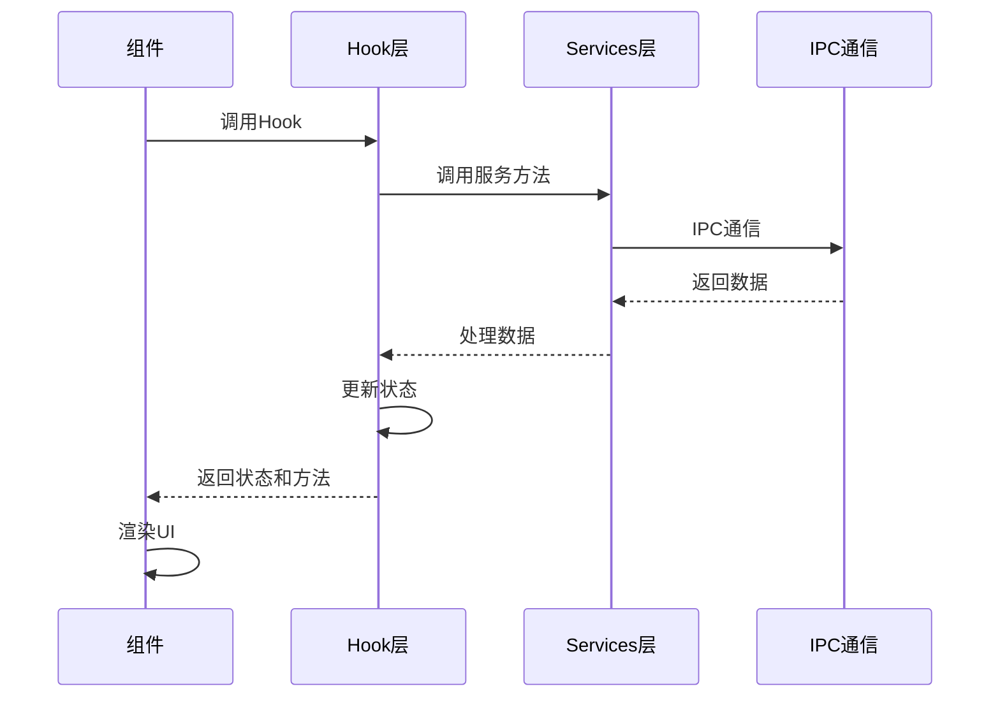

---

### Services 层

**架构定位（3行）**:

-   职责：封装IPC通信调用，提供类型安全的服务接口，处理数据转换和错误处理
-   依赖：window.electronAPI(IPC), types(类型定义)
-   输出：向hooks和components层提供业务服务函数，隔离IPC调用细节

#### 服务架构

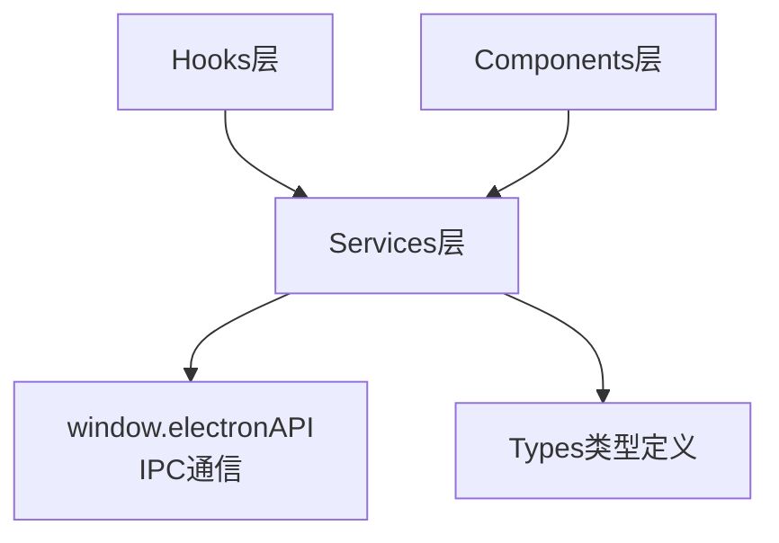

#### 服务清单

**stockService.ts**
-   **地位**：股票数据服务
-   **功能**：封装股票相关的IPC调用，提供数据获取和处理
-   **关键函数**：
    -   `getAnnouncementsGrouped()` - 获取聚合公告列表
    -   `getAllStocks()` - 获取所有股票列表
-   **关键依赖**：favoriteStockService(收藏状态标记)

**favoriteStockService.ts**
-   **地位**：收藏状态服务
-   **功能**：为股票列表标记收藏状态
-   **关键函数**：
    -   `markFavoriteStatus()` - 为股票列表添加isFavorite字段
-   **使用场景**：在获取股票数据后，统一标记收藏状态

**stockListSync.ts**
-   **地位**：股票列表同步服务
-   **功能**：封装股票列表同步的业务逻辑，管理同步状态和进度
-   **关键类**：
    -   `StockListSyncService` - 同步服务类
    -   `isSyncedToday()` - 检查今日是否已同步
    -   `sync()` - 执行同步操作
    -   `onProgress()` - 设置进度回调

#### 服务使用流程

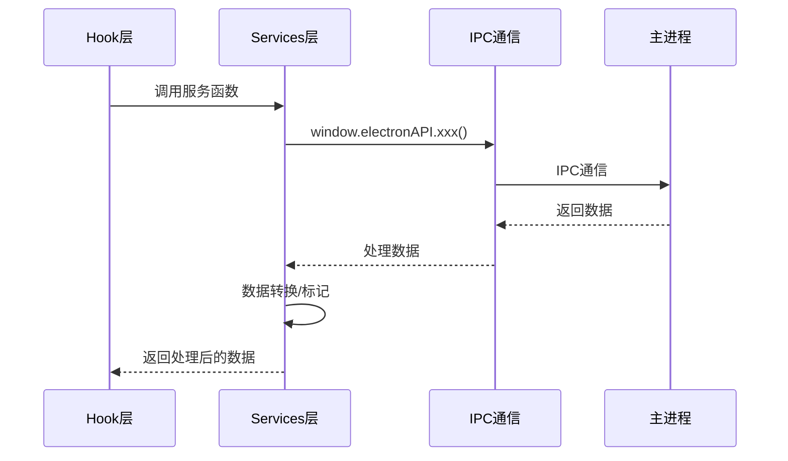

---

### Types 层

**架构定位（3行）**:

-   职责：定义TypeScript类型和接口，提供类型安全和代码提示
-   依赖：无（类型定义）
-   输出：向其他层提供类型定义，确保类型安全和代码一致性

#### 类型架构

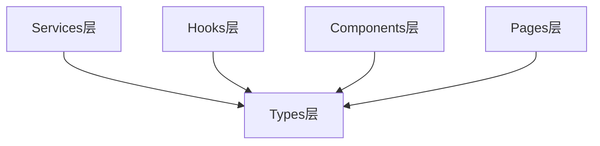

#### 类型清单

**stock.ts**
-   **地位**：股票相关类型定义
-   **功能**：定义股票、股票聚合、筛选条件等数据结构
-   **关键类型**：
    -   `Stock` - 股票基础信息
    -   `StockGroup` - 股票聚合信息（用于公告列表）
    -   `StockFilter` - 股票筛选条件
    -   `StockListQueryResult` - 查询结果类型
    -   `MarketCapRange` - 市值范围筛选

---

### Utils 层

**架构定位（3行）**:

-   职责：提供可复用的纯函数工具，不依赖业务逻辑和状态
-   依赖：无（纯函数）或仅依赖标准库
-   输出：向其他层提供工具函数，提高代码复用性

#### 工具架构

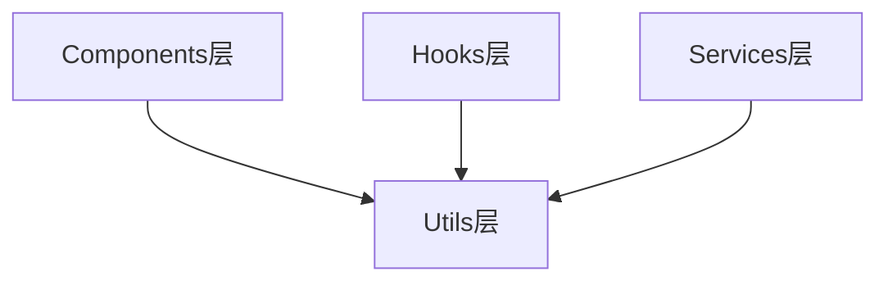

#### 工具清单

**announcementClassifier.ts**
-   **地位**：公告分类工具
-   **功能**：基于规则匹配对公告标题进行智能分类
-   **关键函数**：
    -   `classifyAnnouncement()` - 单个公告分类
    -   `classifyAnnouncements()` - 批量公告分类
    -   `getCategoryColor()` - 获取分类颜色
    -   `getCategoryIcon()` - 获取分类图标
    -   `getCategoryStats()` - 获取分类统计
-   **分类规则**：基于863,580条公告的10,000条样本分析生成
-   **支持分类**：财务报告、分红派息、重大事项、股权变动等30+类别

---

## 维护原则

### 局部影响整体

当你修改一个文件时：

1. 更新文件开头的注释（文件层）
2. 更新所在目录的 README.md（目录层）
3. 如影响架构，更新本文档（系统层）

### 整体影响局部

当架构发生变化时：

1. 更新本文档（系统层）
2. 更新受影响模块的 README.md（目录层）
3. 更新受影响文件的注释（文件层）

### 自指与递归

每个层级都包含"更新我"的提醒，形成自指循环：

-   文件提醒：我变了，更新目录文档
-   目录提醒：我变了，更新系统文档
-   系统提醒：我变了，检查所有模块

---

## 扩展指南

### 为新模块添加分形结构

1. **为每个文件添加注释头**

    - 使用标准的 依赖/输出/职责 格式
    - 添加更新提醒

2. **创建目录级 README.md**

    - 包含架构定位（3 行）
    - 列出所有文件及功能
    - 添加自指声明
    - 使用 Mermaid 图表说明依赖关系

3. **更新上层文档**

    - 更新根目录 README.md 的模块导航
    - 更新本文档的模块详解章节

4. **运行验证工具**
    - 使用 `node scripts/validate-fractal-docs.cjs` 检查完整性

---

**文档版本**: 1.0  
**最后更新**: 2025-12-27  
**维护者**: CafeStock 开发团队


