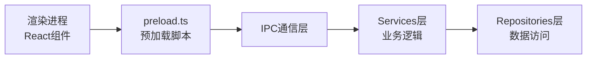
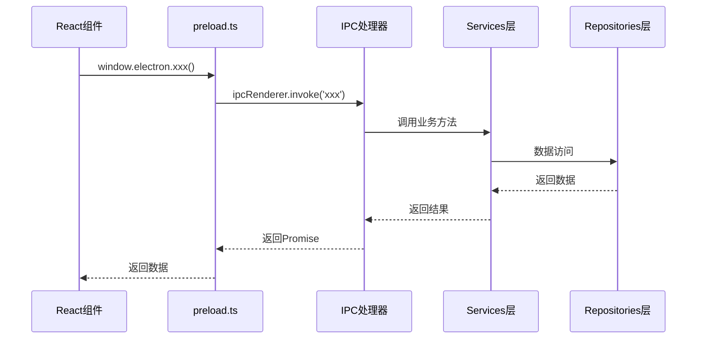

# IPC 通信层 - 主进程与渲染进程通信

**架构定位（3行）**:

-   职责：定义主进程与渲染进程的通信协议，实现IPC处理器，调用服务层方法
-   依赖：services（业务逻辑层）、repositories（数据访问层）、Electron IPC API
-   输出：向渲染进程提供可调用的IPC接口，是主进程与渲染进程的桥梁

⚠️ **自指声明**：一旦本文件夹有文件新增/删除/重命名，请立即更新本 README 的文件清单

---

## 通信架构



---

## IPC 通信流程



---

## 文件清单与功能说明

### 核心处理器

#### announcement.ts

-   **地位**：公告业务IPC处理器
-   **功能**：处理公告相关的IPC调用（获取、同步、搜索、PDF下载）
-   **关键IPC通道**：
    -   `get-announcements` - 获取公告列表
    -   `sync-announcements` - 同步公告数据
    -   `search-announcements` - 搜索公告
    -   `get-announcement-pdf` - 获取PDF文件

#### stock.ts

-   **地位**：股票业务IPC处理器
-   **功能**：处理股票相关的IPC调用（列表、同步、详情）
-   **关键IPC通道**：
    -   `get-all-stocks` - 获取所有股票
    -   `sync-stocks` - 同步股票列表
    -   `get-stock-details` - 获取股票详情
    -   `get-stock-sync-progress` - 获取同步进度

#### holder.ts

-   **地位**：股东业务IPC处理器
-   **功能**：处理股东相关的IPC调用（查询、同步）
-   **关键IPC通道**：
    -   `get-top10-holders` - 获取十大股东
    -   `sync-holders` - 同步股东数据
    -   `pause-holder-sync` / `resume-holder-sync` - 控制同步

#### favorite.ts

-   **地位**：收藏业务IPC处理器
-   **功能**：处理收藏相关的IPC调用（增删查）
-   **关键IPC通道**：
    -   `add-favorite-stock` - 添加收藏
    -   `remove-favorite-stock` - 移除收藏
    -   `get-all-favorite-stocks` - 获取所有收藏

#### classification.ts

-   **地位**：分类规则IPC处理器
-   **功能**：处理分类规则相关的IPC调用（CRUD）
-   **关键IPC通道**：
    -   `get-classification-categories` - 获取所有分类
    -   `get-classification-rules` - 获取所有规则
    -   `update-classification-rule` - 更新规则

#### database.ts

-   **地位**：数据库管理IPC处理器
-   **功能**：处理数据库管理相关的IPC调用（连接信息、导出、HTTP服务）
-   **关键IPC通道**：
    -   `get-db-connection-info` - 获取数据库连接信息
    -   `export-db` - 导出数据库
    -   `start-sqlite-http-server` - 启动HTTP服务
    -   `get-column-widths` / `save-column-widths` - 列宽配置

#### system.ts

-   **地位**：系统功能IPC处理器
-   **功能**：处理系统级功能的IPC调用（通知、版本、外部链接）
-   **关键IPC通道**：
    -   `show-notification` - 显示系统通知
    -   `get-app-version` - 获取应用版本
    -   `open-external` - 打开外部链接

#### updater.ts

-   **地位**：自动更新IPC处理器
-   **功能**：处理自动更新相关的IPC调用（检查、下载、安装）
-   **关键IPC通道**：
    -   `check-for-updates` - 检查更新
    -   `download-update` - 下载更新
    -   `install-update` - 安装更新

#### index.ts

-   **地位**：IPC处理器聚合入口
-   **功能**：统一注册所有IPC处理器
-   **关键函数**：
    -   `setupIPC()` - 注册所有IPC处理器的主入口

### 中间件目录

#### middleware/

包含IPC通信层的中间件：

##### errorHandler.ts

-   **地位**：错误处理中间件
-   **功能**：统一处理IPC调用中的错误，提供标准响应格式
-   **关键函数**：
    -   `withErrorHandler()` - 错误处理包装函数

##### index.ts

-   **功能**：统一导出所有中间件

---

## IPC通道清单

### 公告相关（announcement.ts）

| IPC通道                    | 功能           | 参数                                    | 返回值              |
| -------------------------- | -------------- | --------------------------------------- | ------------------- |
| `get-announcements`        | 获取公告列表   | page, pageSize, startDate, endDate, ...  | AnnouncementListResponse |
| `sync-announcements`       | 同步公告数据   | startDate, endDate, market               | SyncResult          |
| `search-announcements`     | 搜索公告       | keyword, page, pageSize, ...             | AnnouncementListResponse |
| `get-announcement-pdf`     | 获取PDF文件    | tsCode, annDate, title                   | PDF Buffer          |

### 股票相关（stock.ts）

| IPC通道                    | 功能           | 参数                                    | 返回值              |
| -------------------------- | -------------- | --------------------------------------- | ------------------- |
| `get-all-stocks`           | 获取所有股票   | -                                       | Stock[]             |
| `sync-stocks`              | 同步股票列表   | -                                       | SyncResult          |
| `get-stock-details`       | 获取股票详情   | tsCode                                  | StockDetail         |
| `get-stock-sync-progress` | 获取同步进度   | -                                       | SyncProgress        |

### 股东相关（holder.ts）

| IPC通道                    | 功能           | 参数                                    | 返回值              |
| -------------------------- | -------------- | --------------------------------------- | ------------------- |
| `get-top10-holders`        | 获取十大股东   | tsCode, period, annDate, ...            | Top10Holder[]       |
| `sync-holders`             | 同步股东数据   | -                                       | SyncResult          |
| `pause-holder-sync`        | 暂停同步       | -                                       | void                |
| `resume-holder-sync`       | 恢复同步       | -                                       | void                |

### 收藏相关（favorite.ts）

| IPC通道                    | 功能           | 参数                                    | 返回值              |
| -------------------------- | -------------- | --------------------------------------- | ------------------- |
| `add-favorite-stock`       | 添加收藏       | tsCode                                  | { success: boolean } |
| `remove-favorite-stock`    | 移除收藏       | tsCode                                  | { success: boolean } |
| `get-all-favorite-stocks`  | 获取所有收藏   | -                                       | string[]            |

### 分类相关（classification.ts）

| IPC通道                    | 功能           | 参数                                    | 返回值              |
| -------------------------- | -------------- | --------------------------------------- | ------------------- |
| `get-classification-categories` | 获取所有分类 | -                                       | Category[]          |
| `get-classification-rules`     | 获取所有规则 | -                                       | Rule[]              |
| `update-classification-rule`   | 更新规则     | ruleId, updates                         | { success: boolean } |

### 数据库相关（database.ts）

| IPC通道                    | 功能           | 参数                                    | 返回值              |
| -------------------------- | -------------- | --------------------------------------- | ------------------- |
| `get-db-connection-info`   | 获取连接信息   | -                                       | ConnectionInfo      |
| `export-db`                | 导出数据库     | filePath                                | { success: boolean } |
| `start-sqlite-http-server` | 启动HTTP服务   | port, username, password                | { success: boolean } |

### 系统相关（system.ts）

| IPC通道                    | 功能           | 参数                                    | 返回值              |
| -------------------------- | -------------- | --------------------------------------- | ------------------- |
| `show-notification`        | 显示通知       | title, body                             | { success: boolean } |
| `get-app-version`          | 获取版本       | -                                       | string              |
| `open-external`            | 打开外部链接   | url                                      | void                |

### 更新相关（updater.ts）

| IPC通道                    | 功能           | 参数                                    | 返回值              |
| -------------------------- | -------------- | --------------------------------------- | ------------------- |
| `check-for-updates`        | 检查更新       | -                                       | UpdateInfo          |
| `download-update`          | 下载更新       | -                                       | { success: boolean } |
| `install-update`            | 安装更新       | -                                       | void                |

---

## 错误处理

所有IPC处理器都使用 `withErrorHandler` 中间件进行统一错误处理：

```typescript
import { withErrorHandler } from "./middleware/errorHandler.js";

ipcMain.handle(
  "some-channel",
  withErrorHandler(async (_event, ...args) => {
    // 业务逻辑
    return result;
  }, "some-channel")
);
```

错误响应格式：

```typescript
{
  success: false,
  error: {
    code: ErrorCode,
    message: string,
    details?: any
  }
}
```

---

## 扩展指南

**添加新IPC处理器时**：

1. 创建新的处理器文件（如 `newFeature.ts`）
2. 添加标准 INPUT/OUTPUT/POS 注释头
3. 实现 `registerNewFeatureHandlers()` 函数
4. 在 `index.ts` 的 `setupIPC()` 中添加注册调用
5. 更新本 README 的文件清单和IPC通道清单
6. 在 `preload.ts` 中添加对应的API暴露
7. 更新根目录 [`README.md`](../../README.md) 的架构说明

---

**最后更新**：2025-12-26

