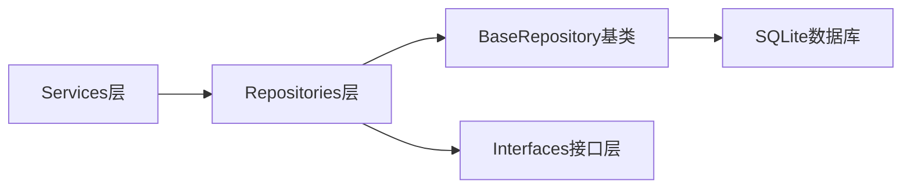
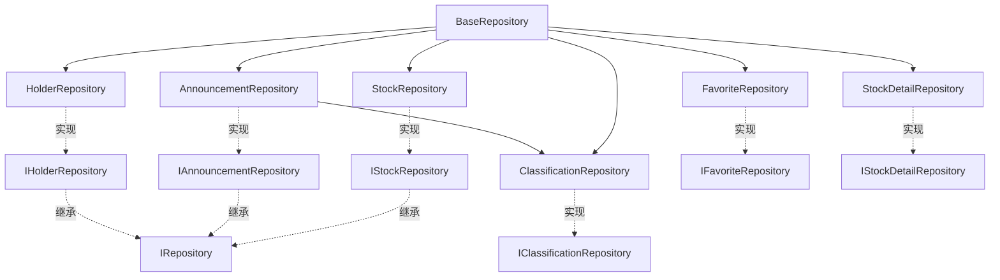

# Repositories 层 - 数据访问层

**架构定位（3行）**:

-   职责：封装数据库操作，实现Repository模式，隔离业务逻辑与数据持久化
-   依赖：database（SQLite连接）、types（实体类型定义）
-   输出：向 services/ 层提供数据访问接口，实现数据访问的抽象和复用

⚠️ **自指声明**：一旦本文件夹有文件新增/删除/重命名，请立即更新本 README 的文件清单

---

## 数据流架构



---

## 设计模式

本层采用 **Repository 模式**，实现以下目标：

-   **数据访问抽象**：将数据访问逻辑从业务逻辑中分离
-   **接口隔离**：通过接口定义契约，实现依赖倒置
-   **代码复用**：BaseRepository 提供通用功能，减少重复代码
-   **易于测试**：接口定义便于 Mock 和单元测试

---

## 文件清单与功能说明

### 基础类

#### base/BaseRepository.ts

-   **地位**：数据访问层基类
-   **功能**：提供通用数据库操作方法（事务、日期格式化、时间戳等）
-   **关键方法**：
    -   `transaction()` - 执行事务
    -   `getCurrentTimestamp()` - 获取当前时间戳
    -   `formatDateToYYYYMMDD()` - 日期格式化
    -   `getPreviousDay()` / `getNextDay()` - 日期计算

### 实现类目录

#### implementations/

包含所有Repository的具体实现：

##### StockRepository.ts

-   **地位**：股票数据访问实现
-   **功能**：股票表的CRUD操作、搜索、统计
-   **关键方法**：
    -   `upsertStocks()` - 批量插入或更新股票
    -   `getAllStocks()` - 获取所有股票
    -   `searchStocks()` - 关键词搜索
    -   `countStocks()` - 统计股票数量

##### AnnouncementRepository.ts

-   **地位**：公告数据访问实现
-   **功能**：公告表的CRUD操作、智能分类、聚合查询
-   **关键方法**：
    -   `upsertAnnouncements()` - 批量插入或更新公告（自动分类）
    -   `getAnnouncementsByStock()` - 按股票查询公告
    -   `getAnnouncementsByDateRange()` - 按日期范围查询
    -   `getGroupedAnnouncements()` - 聚合查询（按股票分组）

##### HolderRepository.ts

-   **地位**：股东数据访问实现
-   **功能**：十大股东表的CRUD操作、查询
-   **关键方法**：
    -   `upsertTop10Holders()` - 批量插入或更新股东数据
    -   `getTop10HoldersByStock()` - 按股票查询股东
    -   `getTop10HoldersEndDates()` - 获取报告期列表

##### FavoriteRepository.ts

-   **地位**：收藏数据访问实现
-   **功能**：收藏表的CRUD操作
-   **关键方法**：
    -   `addFavoriteStock()` - 添加收藏
    -   `removeFavoriteStock()` - 移除收藏
    -   `getAllFavoriteStocks()` - 获取所有收藏
    -   `isFavoriteStock()` - 检查是否收藏

##### StockDetailRepository.ts

-   **地位**：股票详情数据访问实现
-   **功能**：股票日线指标和公司信息的CRUD操作
-   **关键方法**：
    -   `upsertDailyBasic()` - 批量插入或更新日线指标
    -   `upsertCompanyInfo()` - 批量插入或更新公司信息
    -   `getDailyBasicByCode()` - 获取最新市值数据
    -   `getLatestMarketValue()` - 获取最新市值（用于列表展示）

##### ClassificationRepository.ts

-   **地位**：分类规则数据访问实现
-   **功能**：分类规则表的CRUD操作
-   **关键方法**：
    -   `getClassificationCategories()` - 获取所有分类
    -   `getClassificationRules()` - 获取所有规则
    -   `updateRule()` - 更新分类规则
    -   `createCategory()` - 创建新分类

##### index.ts

-   **功能**：统一导出所有Repository实现类
-   **作用**：提供单一入口点，简化导入路径

### 接口定义目录

#### interfaces/

包含所有Repository的TypeScript接口定义：

-   **IRepository.ts** - 基础Repository接口（泛型）
-   **IStockRepository.ts** - 股票Repository接口
-   **IAnnouncementRepository.ts** - 公告Repository接口
-   **IHolderRepository.ts** - 股东Repository接口
-   **IFavoriteRepository.ts** - 收藏Repository接口
-   **IStockDetailRepository.ts** - 股票详情Repository接口
-   **IClassificationRepository.ts** - 分类Repository接口
-   **index.ts** - 统一导出

---

## Repository间依赖关系



---

## 数据库表映射

| Repository              | 数据库表              | 主要字段                          |
| ----------------------- | --------------------- | --------------------------------- |
| StockRepository         | stocks                | ts_code, name, market, list_date   |
| AnnouncementRepository | announcements         | ts_code, ann_date, title, category |
| HolderRepository        | top10_holders         | ts_code, end_date, holder_name    |
| FavoriteRepository      | favorites             | ts_code, created_at               |
| StockDetailRepository   | stock_daily_basic     | ts_code, trade_date, total_mv     |
| StockDetailRepository   | company_info          | ts_code, company_name, industry   |
| ClassificationRepository| classification_rules  | category_key, pattern, priority   |

---

## 使用示例

### 创建Repository实例

```typescript
import { getDb } from "../db.js";
import { StockRepository } from "./implementations/StockRepository.js";

const db = getDb();
const stockRepository = new StockRepository(db);
```

### 使用Repository方法

```typescript
// 批量插入股票
stockRepository.upsertStocks(stocks);

// 搜索股票
const results = stockRepository.searchStocks("平安", 10);

// 获取所有股票
const allStocks = stockRepository.getAllStocks();
```

### 通过接口使用（依赖注入）

```typescript
import { IStockRepository } from "./interfaces/IStockRepository.js";

class StockService {
  constructor(private stockRepo: IStockRepository) {}
  
  async syncStocks() {
    const stocks = await this.fetchFromAPI();
    this.stockRepo.upsertStocks(stocks);
  }
}
```

---

## 扩展指南

**添加新Repository时**：

1. 在 `interfaces/` 创建接口文件（如 `INewRepository.ts`）
2. 添加标准 INPUT/OUTPUT/POS 注释头
3. 在 `implementations/` 创建实现文件（如 `NewRepository.ts`）
4. 继承 `BaseRepository` 并实现对应接口
5. 在 `implementations/index.ts` 添加导出
6. 在 `interfaces/index.ts` 添加导出
7. 更新本 README 的文件清单
8. 在父目录 [`../README.md`](../../README.md) 中更新架构说明

---

**最后更新**：2025-12-26

