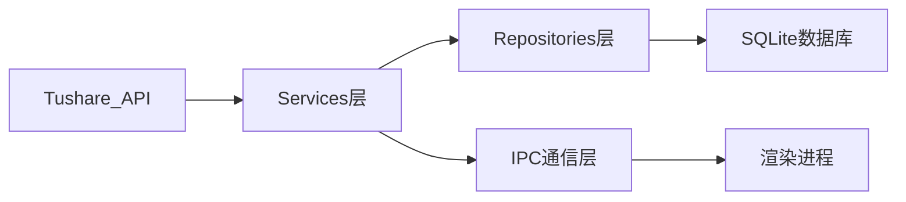
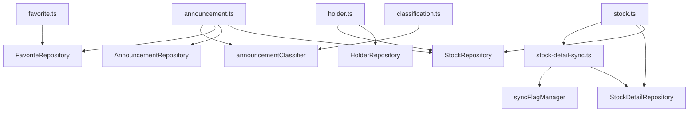

# Services 层 - 业务逻辑服务

**架构定位（3行）**:
- 职责：封装业务逻辑，协调外部API与数据持久层，提供IPC调用接口
- 依赖：repositories（数据访问）、tushare（外部API）、database（连接管理）
- 输出：向 ipc/ 层提供可调用的业务方法，是主进程的业务逻辑中枢

⚠️ **自指声明**：一旦本文件夹有文件新增/删除/重命名，请立即更新本 README 的文件清单

---

## 数据流架构

---

## 文件清单与功能说明

### 核心服务实现

#### announcement.ts
- **地位**：公告业务核心服务
- **功能**：同步公告数据、智能分类（重要/财报/重组等）、PDF下载管理、聚合查询
- **关键依赖**：TushareClient, AnnouncementRepository, announcementClassifier
- **对外接口**：syncAnnouncements(), getGroupedAnnouncements()

#### stock.ts
- **地位**：股票数据服务核心
- **功能**：股票列表同步、详情数据同步、增量更新协调
- **关键依赖**：TushareClient, StockRepository, StockDetailRepository
- **对外接口**：syncStocksIfNeeded(), syncAllStocks()

#### holder.ts
- **地位**：股东信息服务
- **功能**：前十大股东、流通股东数据同步，支持增量更新
- **关键依赖**：TushareClient, HolderRepository
- **对外接口**：syncAllTop10Holders(), pauseSync(), resumeSync(), stopSync()

#### favorite.ts
- **地位**：用户收藏服务
- **功能**：股票收藏的增删改查业务逻辑
- **关键依赖**：FavoriteRepository
- **对外接口**：addFavoriteStock(), removeFavoriteStock(), getAllFavoriteStocks()

#### classification.ts
- **地位**：分类规则服务
- **功能**：公告智能分类逻辑管理
- **关键依赖**：announcementClassifier
- **对外接口**：classifyAnnouncementTitle(), classifyAnnouncementsBatch()

#### stock-detail-sync.ts
- **地位**：低级别同步引擎
- **功能**：股票详情增量同步、断点续传、进度管理
- **关键依赖**：TushareClient, StockDetailRepository, syncFlagManager
- **对外接口**：syncStockDetailsWithResume(), getStockDetailsSyncProgress()

### 接口定义目录

#### interfaces/
包含所有服务层的 TypeScript 接口定义：
- **IAnnouncementService.ts** - 公告服务接口
- **IStockService.ts** - 股票服务接口
- **IHolderService.ts** - 股东服务接口
- **IFavoriteService.ts** - 收藏服务接口
- **IClassificationService.ts** - 分类服务接口
- **index.ts** - 统一导出

---

## 服务间依赖关系

---

## 扩展指南

**添加新服务时**：
1. 创建服务实现文件（如 `newService.ts`）
2. 添加标准 INPUT/OUTPUT/POS 注释头
3. 在 `interfaces/` 创建对应接口（如 `INewService.ts`）
4. 更新本 README 的文件清单
5. 在 `ipc/` 层注册 IPC 处理器
6. 更新根目录 [`README.md`](../../README.md) 的架构说明

---

**最后更新**：2025-12-26

