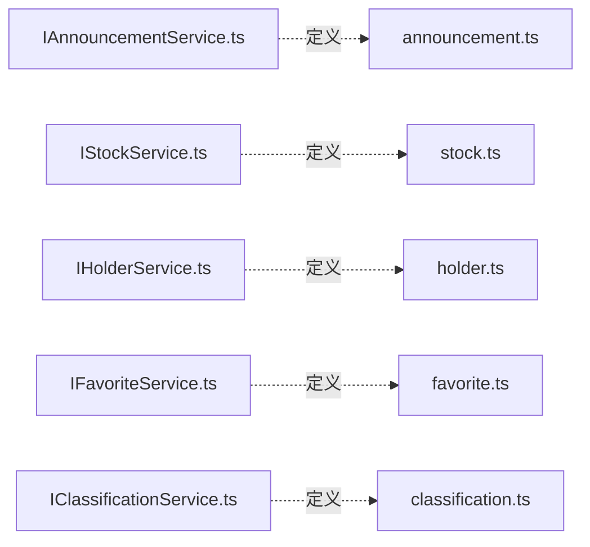

# Services Interfaces - 服务接口定义

**架构定位（3 行）**:

-   职责：定义服务层的 TypeScript 接口规范，确保实现与契约一致
-   依赖：types（类型定义）
-   输出：向服务实现层提供接口契约，向调用方提供类型定义

⚠️ **自指声明**：一旦本文件夹有接口文件新增/删除/重命名，请立即更新本 README 的文件清单

---

## 设计原则

本目录遵循 **接口隔离原则（ISP）**：

-   每个服务对应一个独立的接口文件
-   接口定义仅包含方法签名，不包含实现
-   通过 index.ts 统一导出，提供单一入口

---

## 文件清单与功能说明

### IAnnouncementService.ts

-   **功能**：定义公告服务的接口契约
-   **核心方法**：
    -   `getAnnouncementsGroupedFromAPI()` - 获取聚合公告
    -   `searchAnnouncementsGroupedFromAPI()` - 搜索公告
    -   `syncAnnouncements()` - 同步公告数据
    -   `getAnnouncementPDF()` - 获取 PDF 文件

### IStockService.ts

-   **功能**：定义股票服务的接口契约
-   **核心方法**：
    -   `syncStocksIfNeeded()` - 按需同步股票列表
    -   `syncAllStocks()` - 全量同步股票数据

### IHolderService.ts

-   **功能**：定义股东服务的接口契约
-   **核心方法**：
    -   `syncAllTop10Holders()` - 同步十大股东
    -   `pauseSync()` - 暂停同步
    -   `resumeSync()` - 恢复同步
    -   `stopSync()` - 停止同步

### IFavoriteService.ts

-   **功能**：定义收藏服务的接口契约
-   **核心方法**：
    -   `addFavoriteStock()` - 添加收藏
    -   `removeFavoriteStock()` - 移除收藏

### IClassificationService.ts

-   **功能**：定义分类服务的接口契约
-   **核心方法**：
    -   `classifyAnnouncementTitle()` - 单条分类
    -   `classifyAnnouncementsBatch()` - 批量分类

### index.ts

-   **功能**：统一导出所有服务接口
-   **作用**：提供单一入口点，简化导入路径

---

## 接口与实现的对应关系



---

## 使用指南

### 导入接口

```typescript
// 方式1：从统一入口导入
import { IAnnouncementService, IStockService } from "./interfaces";

// 方式2：从具体文件导入
import { IAnnouncementService } from "./interfaces/IAnnouncementService";
```

### 实现接口

```typescript
import { IStockService } from "./interfaces";

class StockService implements IStockService {
	async syncStocksIfNeeded(): Promise<void> {
		// 实现逻辑
	}

	async syncAllStocks(onProgress?: Function): Promise<SyncResult> {
		// 实现逻辑
	}
}
```

---

## 扩展指南

**添加新接口时**：

1. 创建新的接口文件（如 `INewService.ts`）
2. 添加标准 INPUT/OUTPUT/POS 注释头
3. 定义接口方法签名和类型
4. 在 `index.ts` 中添加导出
5. 更新本 README 的文件清单
6. 在父目录 [`../README.md`](../README.md) 中更新接口列表
7. 创建对应的服务实现文件

---

**最后更新**：2025-12-26
