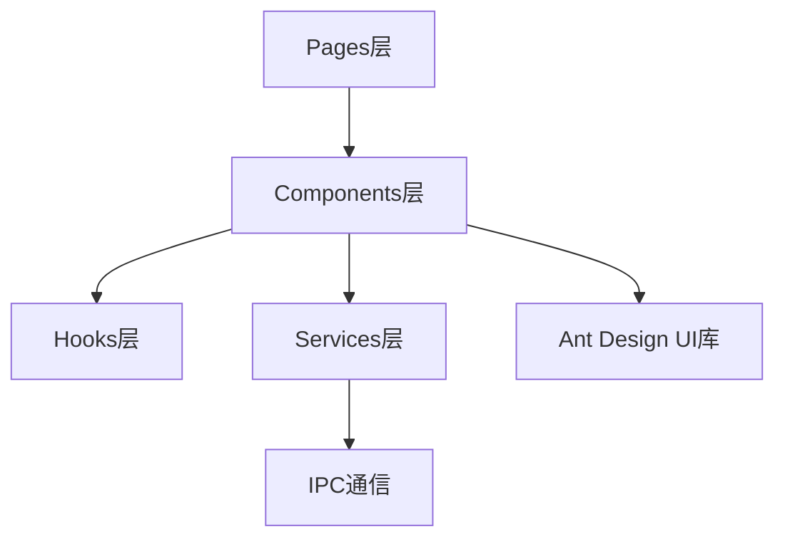
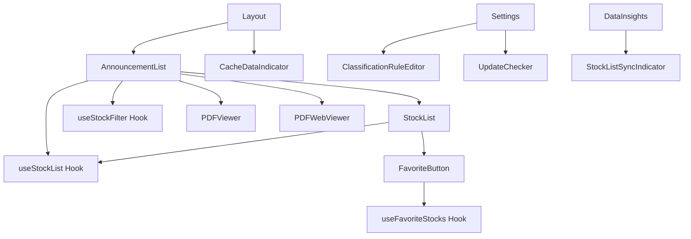

# Components - UI组件层

**架构定位（3行）**:

-   职责：封装可复用的UI组件，提供用户界面展示和交互功能
-   依赖：Ant Design(UI库)、hooks(业务逻辑)、services(IPC通信封装)、types(类型定义)
-   输出：向pages层提供可复用的UI组件，是渲染进程的UI构建基础

⚠️ **自指声明**：一旦本文件夹有文件新增/删除/重命名，请立即更新本 README 的文件清单

---

## 组件架构



---

## 文件清单与功能说明

### 核心业务组件

#### AnnouncementList.tsx

-   **地位**：公告列表核心组件
-   **功能**：公告数据的展示、搜索、筛选、分页、PDF查看
-   **关键依赖**：useStockList, useStockFilter, StockList, announcementClassifier
-   **主要特性**：
    -   支持关键词搜索和搜索历史
    -   支持按市场、日期范围、分类筛选
    -   支持分页浏览（每页200条）
    -   集成PDF查看和下载功能

#### StockList/StockList.tsx

-   **地位**：通用股票列表组件
-   **功能**：股票列表的通用展示，集成收藏功能
-   **关键依赖**：FavoriteButton, useStockList, announcementClassifier
-   **主要特性**：
    -   可调整列宽
    -   支持搜索和筛选
    -   集成收藏按钮
    -   显示最新市值和分类标签

#### FavoriteButton.tsx

-   **地位**：收藏按钮组件
-   **功能**：股票收藏/取消收藏的交互组件
-   **关键依赖**：useFavoriteStocks, window.electronAPI
-   **主要特性**：
    -   可复用的收藏按钮
    -   自动同步收藏状态
    -   提供操作反馈

### 功能组件

#### PDFViewer.tsx

-   **地位**：PDF查看器组件
-   **功能**：公告PDF文件的预览和下载
-   **关键依赖**：react-pdf, window.electronAPI
-   **主要特性**：
    -   支持PDF预览和缩放
    -   支持PDF下载
    -   使用react-pdf库渲染

#### PDFWebViewer.tsx

-   **地位**：WebView版PDF查看器（备选方案）
-   **功能**：使用Electron原生webview展示PDF
-   **关键依赖**：Electron webview API
-   **主要特性**：
    -   基于webview的PDF展示
    -   备选PDF查看方案

#### UpdateChecker.tsx

-   **地位**：自动更新检查器组件
-   **功能**：应用版本检查和更新下载的用户界面
-   **关键依赖**：window.electronAPI
-   **主要特性**：
    -   自动检查更新
    -   显示更新进度
    -   一键下载和安装

#### ClassificationRuleEditor.tsx

-   **地位**：分类规则编辑器组件
-   **功能**：公告分类规则的可视化编辑和管理
-   **关键依赖**：window.electronAPI
-   **主要特性**：
    -   规则的增删改查
    -   规则优先级调整
    -   规则启用/禁用

#### StockListSyncIndicator.tsx

-   **地位**：股票列表同步指示器组件
-   **功能**：显示股票数据同步的进度和状态
-   **关键依赖**：window.electronAPI
-   **主要特性**：
    -   同步进度展示
    -   同步状态反馈
    -   错误提示

#### CacheDataIndicator.tsx

-   **地位**：缓存数据统计指示器组件
-   **功能**：展示本地数据库的统计信息
-   **关键依赖**：window.electronAPI
-   **主要特性**：
    -   显示股票数、公告数、收藏数
    -   显示最后同步时间
    -   数据概览卡片

### 布局组件

#### Layout.tsx

-   **地位**：应用主布局组件
-   **功能**：定义应用的整体结构（导航栏、侧边栏、内容区）
-   **关键依赖**：react-router-dom, CacheDataIndicator
-   **主要特性**：
    -   顶部导航菜单
    -   路由内容区域
    -   缓存数据指示器

### 子目录

#### StockList/

包含股票列表组件的相关文件：

-   **StockList.tsx** - 股票列表组件实现
-   **index.ts** - 统一导出

---

## 组件依赖关系



---

## 使用示例

### 基础组件使用

```tsx
import { AnnouncementList } from "./components/AnnouncementList";
import { FavoriteButton } from "./components/FavoriteButton";

function MyPage() {
  return (
    <div>
      <AnnouncementList />
      <FavoriteButton tsCode="000001.SZ" />
    </div>
  );
}
```

### 布局组件使用

```tsx
import { Layout } from "./components/Layout";
import { Outlet } from "react-router-dom";

function App() {
  return (
    <Layout>
      <Outlet />
    </Layout>
  );
}
```

---

## 扩展指南

**添加新组件时**：

1. 创建组件文件（如 `NewComponent.tsx`）
2. 添加标准 INPUT/OUTPUT/POS 注释头
3. 使用TypeScript和Ant Design
4. 如需要业务逻辑，使用hooks层
5. 如需要IPC通信，通过services层
6. 更新本 README 的文件清单
7. 更新根目录 [`README.md`](../../README.md) 的架构说明

---

**最后更新**：2025-12-26

