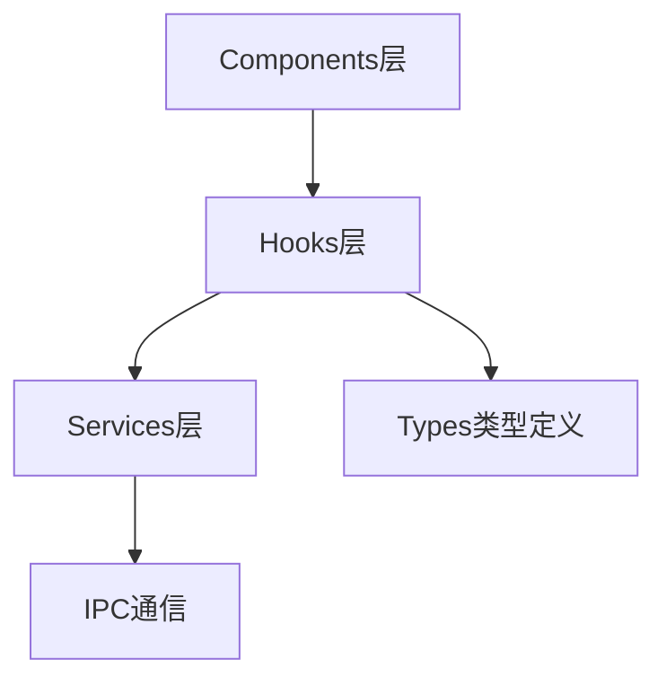
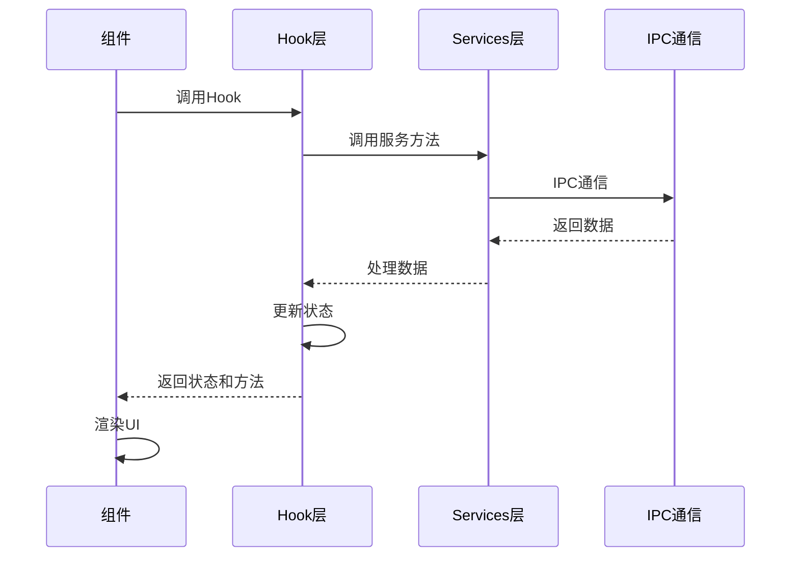
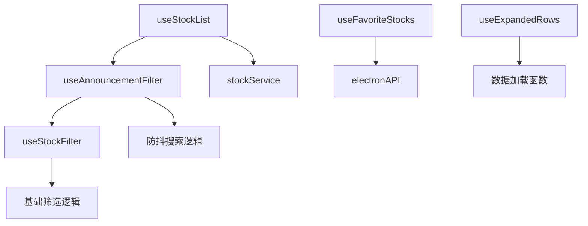

# Hooks - 业务逻辑Hook层

**架构定位（3行）**:

-   职责：封装业务逻辑的状态管理和数据获取，提供可复用的React Hook
-   依赖：services(IPC通信封装)、types(类型定义)、Ant Design(消息提示)
-   输出：向components层提供业务逻辑Hook，隔离UI与业务逻辑

⚠️ **自指声明**：一旦本文件夹有文件新增/删除/重命名，请立即更新本 README 的文件列表

---

## Hook架构



---

## 文件清单与功能说明

### useStockList.ts

-   **地位**：股票列表数据获取Hook
-   **功能**：封装股票列表数据获取逻辑，统一的状态管理和错误处理
-   **关键依赖**：stockService, types, Ant Design App
-   **返回值**：
    -   `stocks` - 股票列表数据
    -   `loading` - 加载状态
    -   `error` - 错误信息
    -   `refresh()` - 刷新数据
    -   `setFilter()` - 设置筛选条件
    -   `setPage()` - 设置页码

### useFavoriteStocks.ts

-   **地位**：收藏股票管理Hook
-   **功能**：管理股票关注状态和操作
-   **关键依赖**：window.electronAPI, Ant Design App
-   **返回值**：
    -   `favoriteCodes` - 收藏的股票代码列表
    -   `loading` - 加载状态
    -   `toggleFavorite()` - 切换收藏状态
    -   `isFavorite()` - 检查是否收藏
    -   `refresh()` - 刷新收藏列表

### useStockFilter.ts

-   **地位**：股票筛选Hook（基础筛选）
-   **功能**：封装股票筛选相关的状态和逻辑，包括市场、日期范围、市值、分类、关注等筛选
-   **关键依赖**：dayjs, types
-   **返回值**：
    -   **基础筛选状态**：
        -   `selectedMarket` - 选中的市场
        -   `searchKeyword` - 搜索关键词
        -   `dateRange` - 日期范围 (YYYYMMDD格式)
        -   `dateRangeDisplay` - 显示用的日期对象
        -   `quickSelectValue` - 快速日期选择值
    -   **市值筛选状态**：
        -   `marketCapFilter` - 市值筛选选项 (all | < 30 | < 50 | < 100 | custom)
        -   `customMarketCapMin` - 自定义最小市值
        -   `customMarketCapMax` - 自定义最大市值
    -   **分类筛选状态**：
        -   `selectedCategories` - 选中的分类数组
    -   **关注筛选状态**：
        -   `showFavoriteOnly` - 是否仅显示关注的股票
    -   **设置方法**：
        -   `setSelectedMarket()` - 设置市场
        -   `setSearchKeyword()` - 设置搜索关键词
        -   `setMarketCapFilter()` - 设置市值筛选
        -   `setCustomMarketCapMin()` - 设置自定义最小市值
        -   `setCustomMarketCapMax()` - 设置自定义最大市值
        -   `setSelectedCategories()` - 设置分类（批量）
        -   `toggleCategory()` - 切换单个分类
        -   `setShowFavoriteOnly()` - 设置关注筛选
        -   `toggleFavoriteFilter()` - 切换关注筛选
    -   **操作方法**：
        -   `handleQuickSelect()` - 快速日期选择
        -   `handleDateRangeChange()` - 日期范围变化
        -   `getFilter()` - 获取完整筛选条件对象
        -   `resetFilter()` - 重置所有筛选条件
        -   `getMarketCapRange()` - 获取市值范围对象

### useAnnouncementFilter.ts

-   **地位**：公告筛选Hook（统一筛选管理）
-   **功能**：整合所有筛选条件，包括防抖搜索、市值筛选、分类筛选等，提供统一的筛选接口
-   **关键依赖**：useStockFilter, types
-   **返回值**：
    -   **继承自 useStockFilter 的所有返回值**
    -   **搜索关键词状态**：
        -   `searchKeyword` - 用户输入的搜索关键词
        -   `debouncedSearchKeyword` - 防抖后的搜索关键词（用于实际触发搜索）
    -   **搜索关键词方法**：
        -   `setSearchKeyword()` - 设置搜索关键词（带防抖）
        -   `setSearchKeywordImmediate()` - 立即设置搜索关键词（跳过防抖）
        -   `clearSearchKeyword()` - 清空搜索关键词
    -   **完整筛选条件**：
        -   `currentFilter` - 包含所有筛选条件的完整对象
    -   **重置方法**：
        -   `resetAllFilters()` - 重置所有筛选条件（包括搜索关键词）

### useExpandedRows.ts

-   **地位**：展开行管理Hook
-   **功能**：封装表格展开行的状态管理、数据加载和分页逻辑
-   **关键依赖**：window.electronAPI, Ant Design App
-   **返回值**：
    -   **状态**：
        -   `expandedRowKeys` - 展开的行键列表
        -   `pageSize` - 每页显示数量
    -   **查询方法**：
        -   `isExpanded()` - 检查是否已展开
        -   `getExpandedData()` - 获取展开行的数据、加载状态和当前页
    -   **操作方法**：
        -   `toggleExpanded()` - 切换展开状态
        -   `setExpanded()` - 设置展开的行键列表
        -   `loadExpandedData()` - 加载展开行数据
        -   `setExpandedPage()` - 设置展开行的当前页
        -   `clearAllExpanded()` - 清空所有展开行数据
        -   `clearExpandedData()` - 清空指定行的数据
        -   `resetAllPages()` - 重置所有展开行的分页到第一页

---

## Hook使用流程



---

## 使用示例

### useStockList

```tsx
import { useStockList } from "../hooks/useStockList";

function StockListComponent() {
  const { stocks, loading, error, refresh, setFilter } = useStockList({
    pageSize: 20,
    initialFilter: { market: "all" }
  });

  return (
    <div>
      {loading && <Spin />}
      {stocks.map(stock => (
        <div key={stock.ts_code}>{stock.name}</div>
      ))}
    </div>
  );
}
```

### useFavoriteStocks

```tsx
import { useFavoriteStocks } from "../hooks/useFavoriteStocks";

function FavoriteButton({ tsCode }: { tsCode: string }) {
  const { isFavorite, toggleFavorite } = useFavoriteStocks();

  return (
    <Button
      icon={isFavorite(tsCode) ? <StarFilled /> : <StarOutlined />}
      onClick={() => toggleFavorite(tsCode)}
    />
  );
}
```

### useStockFilter

```tsx
import { useStockFilter } from "../hooks/useStockFilter";

function FilterPanel() {
  const {
    selectedMarket,
    setSelectedMarket,
    marketCapFilter,
    setMarketCapFilter,
    selectedCategories,
    toggleCategory,
    showFavoriteOnly,
    toggleFavoriteFilter,
    getFilter,
    resetFilter
  } = useStockFilter();

  return (
    <div>
      <Select value={selectedMarket} onChange={setSelectedMarket}>
        <Option value="all">全部</Option>
        <Option value="主板">主板</Option>
      </Select>
      <Select value={marketCapFilter} onChange={setMarketCapFilter}>
        <Option value="all">全部市值</Option>
        <Option value="< 30">< 30亿</Option>
      </Select>
      <Button onClick={toggleFavoriteFilter}>
        {showFavoriteOnly ? "仅关注" : "关注"}
      </Button>
    </div>
  );
}
```

### useExpandedRows

```tsx
import { useExpandedRows } from "../hooks/useExpandedRows";

function DataTable() {
  const expandedRows = useExpandedRows({
    pageSize: 10,
    loadDataFn: async (key: string) => {
      return await window.electronAPI.getDetails(key);
    },
    errorMessage: "加载详情失败",
  });

  return (
    <Table
      dataSource={data}
      expandable={{
        expandedRowKeys: expandedRows.expandedRowKeys,
        onExpandedRowsChange: (keys) => expandedRows.setExpanded(keys as string[]),
        expandedRowRender: (record) => {
          const { data, loading, currentPage } = expandedRows.getExpandedData(record.key);
          return (
            <Table
              loading={loading}
              dataSource={data}
              pagination={{
                current: currentPage,
                pageSize: expandedRows.pageSize,
                onChange: (page) => expandedRows.setExpandedPage(record.key, page),
              }}
            />
          );
        },
      }}
      onRow={(record) => ({
        onClick: () => {
          expandedRows.toggleExpanded(record.key);
          if (!expandedRows.isExpanded(record.key)) {
            expandedRows.loadExpandedData(record.key);
          }
        },
      })}
    />
  );
}
```

---

## Hook设计原则

1. **单一职责**：每个Hook只负责一个业务领域
2. **状态封装**：将相关状态封装在Hook内部
3. **错误处理**：统一处理错误和加载状态
4. **可复用性**：设计为可在多个组件中复用
5. **类型安全**：使用TypeScript确保类型安全

---

## 扩展指南

**添加新Hook时**：

1. 创建Hook文件（如 `useNewFeature.ts`）
2. 添加标准 INPUT/OUTPUT/POS 注释头
3. 使用React Hooks API（useState, useEffect等）
4. 如需要IPC通信，通过services层
5. 提供清晰的返回值接口
6. 处理加载和错误状态
7. 更新本 README 的文件清单
8. 更新根目录 [`README.md`](../../README.md) 的架构说明

---

---

## Hook 层级关系



- **useAnnouncementFilter**: 顶层筛选 Hook，整合所有筛选功能
- **useStockFilter**: 基础筛选 Hook，提供市场、日期、市值、分类等筛选
- **useStockList**: 数据加载 Hook，依赖筛选条件获取数据
- **useFavoriteStocks**: 收藏管理 Hook，独立功能
- **useExpandedRows**: 展开行管理 Hook，通用展开行状态管理和数据加载

---

**最后更新**：2025-12-27（展开行状态管理重构）

