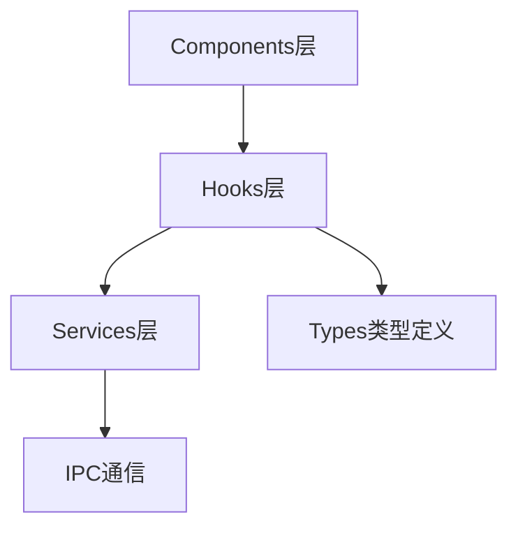
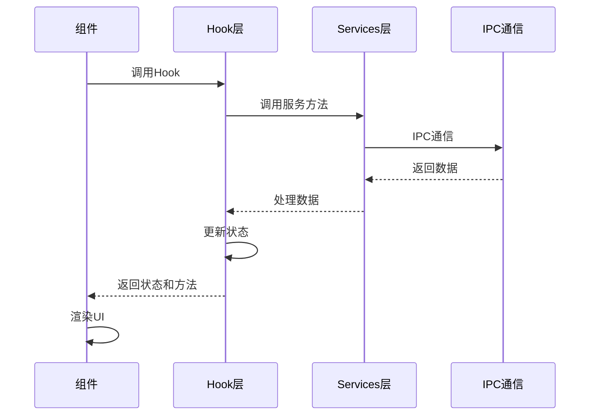

# Hooks - 业务逻辑Hook层

**架构定位（3行）**:

-   职责：封装业务逻辑的状态管理和数据获取，提供可复用的React Hook
-   依赖：services(IPC通信封装)、types(类型定义)、Ant Design(消息提示)
-   输出：向components层提供业务逻辑Hook，隔离UI与业务逻辑

⚠️ **自指声明**：一旦本文件夹有文件新增/删除/重命名，请立即更新本 README 的文件列表

---

## Hook架构



---

## 文件清单与功能说明

### useStockList.ts

-   **地位**：股票列表数据获取Hook
-   **功能**：封装股票列表数据获取逻辑，统一的状态管理和错误处理
-   **关键依赖**：stockService, types, Ant Design App
-   **返回值**：
    -   `stocks` - 股票列表数据
    -   `loading` - 加载状态
    -   `error` - 错误信息
    -   `refresh()` - 刷新数据
    -   `setFilter()` - 设置筛选条件
    -   `setPage()` - 设置页码

### useFavoriteStocks.ts

-   **地位**：收藏股票管理Hook
-   **功能**：管理股票关注状态和操作
-   **关键依赖**：window.electronAPI, Ant Design App
-   **返回值**：
    -   `favoriteCodes` - 收藏的股票代码列表
    -   `loading` - 加载状态
    -   `toggleFavorite()` - 切换收藏状态
    -   `isFavorite()` - 检查是否收藏
    -   `refresh()` - 刷新收藏列表

### useStockFilter.ts

-   **地位**：股票筛选Hook
-   **功能**：封装股票筛选相关的状态和逻辑
-   **关键依赖**：dayjs, types
-   **返回值**：
    -   `filter` - 筛选条件对象
    -   `setMarket()` - 设置市场筛选
    -   `setSearchKeyword()` - 设置搜索关键词
    -   `setDateRange()` - 设置日期范围
    -   `setQuickDate()` - 设置快速日期选择
    -   `resetFilter()` - 重置筛选条件

---

## Hook使用流程



---

## 使用示例

### useStockList

```tsx
import { useStockList } from "../hooks/useStockList";

function StockListComponent() {
  const { stocks, loading, error, refresh, setFilter } = useStockList({
    pageSize: 20,
    initialFilter: { market: "all" }
  });

  return (
    <div>
      {loading && <Spin />}
      {stocks.map(stock => (
        <div key={stock.ts_code}>{stock.name}</div>
      ))}
    </div>
  );
}
```

### useFavoriteStocks

```tsx
import { useFavoriteStocks } from "../hooks/useFavoriteStocks";

function FavoriteButton({ tsCode }: { tsCode: string }) {
  const { isFavorite, toggleFavorite } = useFavoriteStocks();

  return (
    <Button
      icon={isFavorite(tsCode) ? <StarFilled /> : <StarOutlined />}
      onClick={() => toggleFavorite(tsCode)}
    />
  );
}
```

### useStockFilter

```tsx
import { useStockFilter } from "../hooks/useStockFilter";

function FilterPanel() {
  const {
    filter,
    setMarket,
    setSearchKeyword,
    setDateRange,
    resetFilter
  } = useStockFilter();

  return (
    <div>
      <Select value={filter.market} onChange={setMarket}>
        <Option value="all">全部</Option>
        <Option value="主板">主板</Option>
      </Select>
      <Input
        value={filter.searchKeyword}
        onChange={(e) => setSearchKeyword(e.target.value)}
      />
    </div>
  );
}
```

---

## Hook设计原则

1. **单一职责**：每个Hook只负责一个业务领域
2. **状态封装**：将相关状态封装在Hook内部
3. **错误处理**：统一处理错误和加载状态
4. **可复用性**：设计为可在多个组件中复用
5. **类型安全**：使用TypeScript确保类型安全

---

## 扩展指南

**添加新Hook时**：

1. 创建Hook文件（如 `useNewFeature.ts`）
2. 添加标准 INPUT/OUTPUT/POS 注释头
3. 使用React Hooks API（useState, useEffect等）
4. 如需要IPC通信，通过services层
5. 提供清晰的返回值接口
6. 处理加载和错误状态
7. 更新本 README 的文件清单
8. 更新根目录 [`README.md`](../../README.md) 的架构说明

---

**最后更新**：2025-12-26

