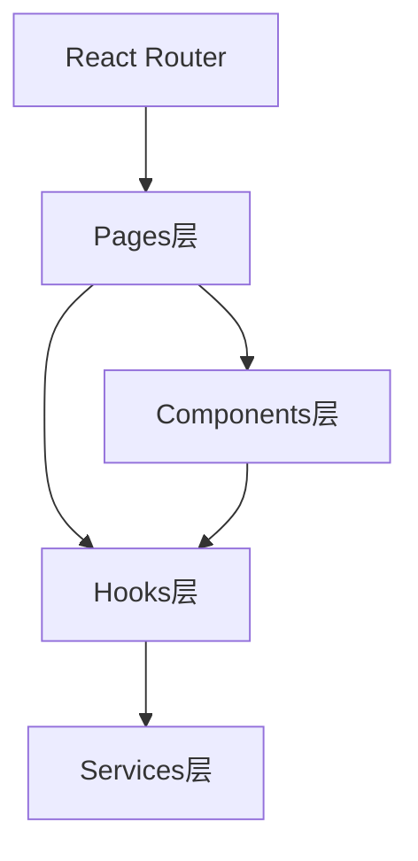
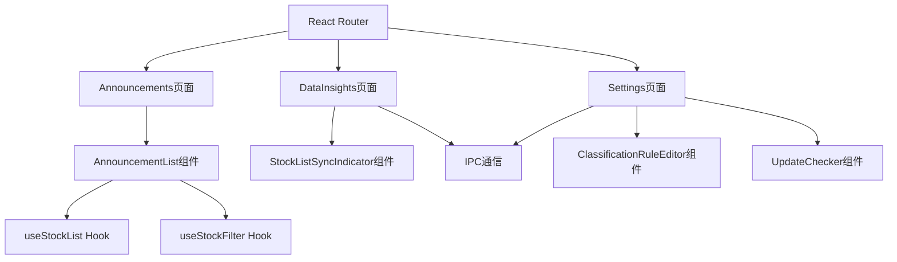

# Pages - 页面层

**架构定位（3行）**:

-   职责：定义应用的路由页面，组合components和hooks，形成完整的页面功能
-   依赖：components(UI组件)、hooks(业务逻辑)、react-router-dom(路由)
-   输出：向路由系统提供页面组件，是用户访问的功能入口

⚠️ **自指声明**：一旦本文件夹有文件新增/删除/重命名，请立即更新本 README 的文件清单

---

## 页面架构



---

## 文件清单与功能说明

### Announcements.tsx

-   **地位**：公告列表页面
-   **功能**：公告功能的主入口页面
-   **关键依赖**：AnnouncementList组件
-   **路由路径**：`/announcements`
-   **主要特性**：
    -   公告列表展示
    -   搜索和筛选
    -   PDF查看和下载

### DataInsights.tsx

-   **地位**：数据洞察页面
-   **功能**：数据分析和洞察功能的主界面
-   **关键依赖**：window.electronAPI, Ant Design组件
-   **路由路径**：`/data-insights`
-   **主要特性**：
    -   股东数据同步
    -   同步进度展示
    -   数据统计展示
    -   十大股东查询

### Settings.tsx

-   **地位**：设置页面
-   **功能**：应用设置和配置管理的主界面
-   **关键依赖**：ClassificationRuleEditor, window.electronAPI
-   **路由路径**：`/settings`
-   **主要特性**：
    -   分类规则管理
    -   数据库管理
    -   应用配置
    -   自动更新设置

---

## 路由配置

页面组件通过React Router配置路由：

```tsx
import { BrowserRouter, Routes, Route } from "react-router-dom";
import { Announcements } from "./pages/Announcements";
import { DataInsights } from "./pages/DataInsights";
import { Settings } from "./pages/Settings";

function App() {
  return (
    <BrowserRouter>
      <Routes>
        <Route path="/announcements" element={<Announcements />} />
        <Route path="/data-insights" element={<DataInsights />} />
        <Route path="/settings" element={<Settings />} />
      </Routes>
    </BrowserRouter>
  );
}
```

---

## 页面组件结构



---

## 页面设计原则

1. **简洁性**：页面组件应保持简洁，主要逻辑委托给components和hooks
2. **组合性**：通过组合components和hooks构建页面功能
3. **路由映射**：每个页面对应一个路由路径
4. **类型安全**：使用TypeScript确保类型安全

---

## 扩展指南

**添加新页面时**：

1. 创建页面文件（如 `NewPage.tsx`）
2. 添加标准 INPUT/OUTPUT/POS 注释头
3. 组合components和hooks构建页面
4. 在路由配置中添加路由
5. 在Layout导航菜单中添加菜单项
6. 更新本 README 的文件清单
7. 更新根目录 [`README.md`](../../README.md) 的架构说明

---

**最后更新**：2025-12-26

