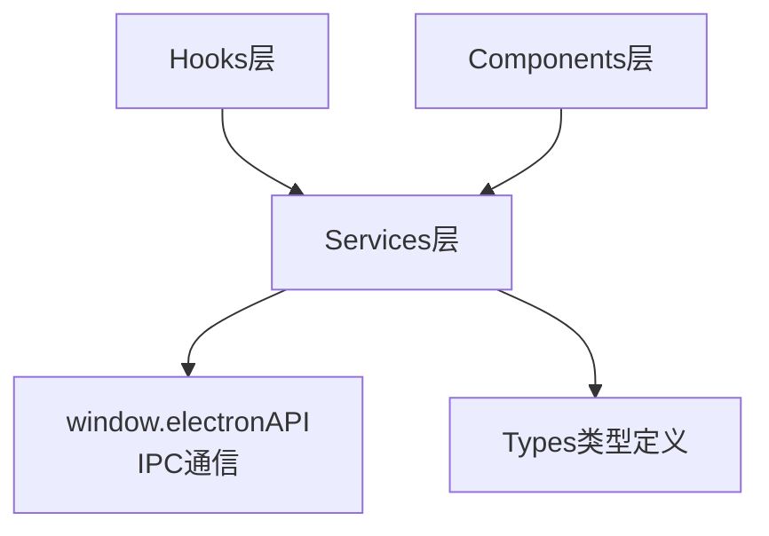
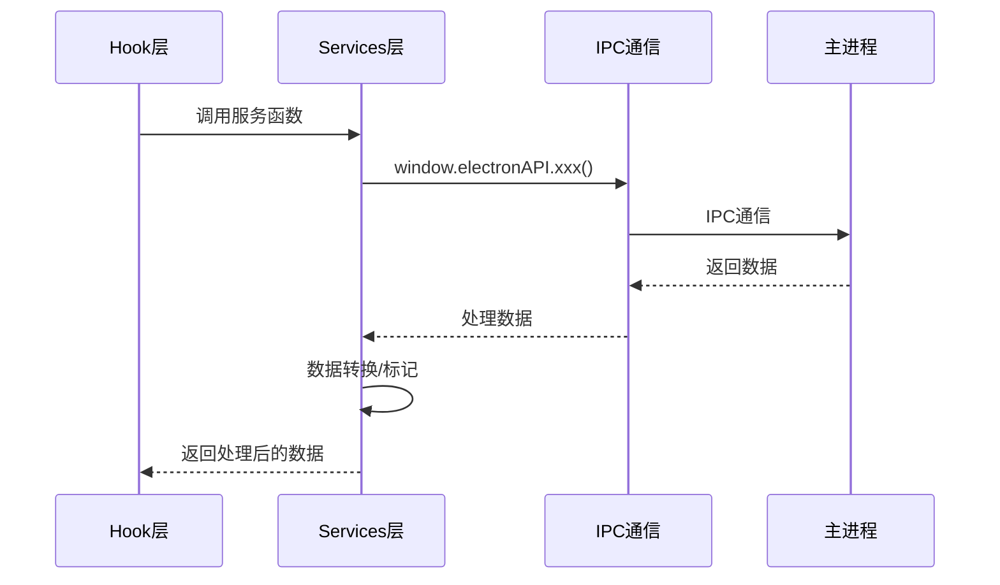

# Services - IPC通信封装层

**架构定位（3行）**:

-   职责：封装IPC通信调用，提供类型安全的服务接口，处理数据转换和错误处理
-   依赖：window.electronAPI(IPC), types(类型定义)
-   输出：向hooks和components层提供业务服务函数，隔离IPC调用细节

⚠️ **自指声明**：一旦本文件夹有文件新增/删除/重命名，请立即更新本 README 的文件清单

---

## 服务架构



---

## 文件清单与功能说明

### stockService.ts

-   **地位**：股票数据服务
-   **功能**：封装股票相关的IPC调用，提供数据获取和处理
-   **关键函数**：
    -   `getAnnouncementsGrouped()` - 获取聚合公告列表
    -   `getAllStocks()` - 获取所有股票列表
-   **关键依赖**：favoriteStockService(收藏状态标记)

### favoriteStockService.ts

-   **地位**：收藏状态服务
-   **功能**：为股票列表标记收藏状态
-   **关键函数**：
    -   `markFavoriteStatus()` - 为股票列表添加isFavorite字段
-   **使用场景**：在获取股票数据后，统一标记收藏状态

### stockListSync.ts

-   **地位**：股票列表同步服务
-   **功能**：封装股票列表同步的业务逻辑，管理同步状态和进度
-   **关键类**：
    -   `StockListSyncService` - 同步服务类
    -   `isSyncedToday()` - 检查今日是否已同步
    -   `sync()` - 执行同步操作
    -   `onProgress()` - 设置进度回调

---

## 服务使用流程



---

## 使用示例

### stockService

```typescript
import { getAnnouncementsGrouped } from "../services/stockService";

const result = await getAnnouncementsGrouped(
  1,      // page
  20,     // pageSize
  "20240101", // startDate
  "20241231", // endDate
  "all",  // market
  false,  // forceRefresh
  "平安", // searchKeyword
  ["财务报告"] // categories
);
```

### favoriteStockService

```typescript
import { markFavoriteStatus } from "../services/favoriteStockService";

const stocks = await getAllStocks();
const stocksWithFavorite = await markFavoriteStatus(stocks);
// stocksWithFavorite 中每个股票都有 isFavorite 字段
```

### stockListSync

```typescript
import { StockListSyncService } from "../services/stockListSync";

const syncService = new StockListSyncService();

syncService.onProgress((progress) => {
  console.log(`同步进度: ${progress.current}/${progress.total}`);
});

await syncService.sync();
```

---

## 设计原则

1. **类型安全**：所有服务函数都有完整的TypeScript类型定义
2. **错误处理**：统一处理IPC调用错误
3. **数据转换**：在服务层完成数据格式转换
4. **状态管理**：封装复杂的状态管理逻辑（如同步服务）

---

## 扩展指南

**添加新服务时**：

1. 创建服务文件（如 `newService.ts`）
2. 添加标准 INPUT/OUTPUT/POS 注释头
3. 封装IPC调用，提供类型安全的接口
4. 处理错误和数据转换
5. 更新本 README 的文件清单
6. 更新根目录 [`README.md`](../../README.md) 的架构说明

---

**最后更新**：2025-12-26

