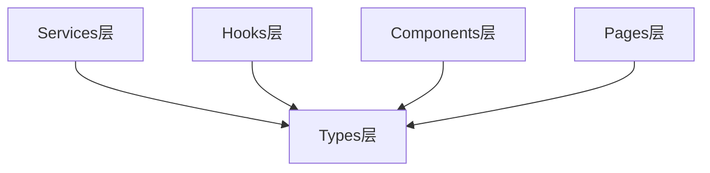

# Types - 类型定义层

**架构定位（3行）**:

-   职责：定义TypeScript类型和接口，提供类型安全和代码提示
-   依赖：无（类型定义）
-   输出：向其他层提供类型定义，确保类型安全和代码一致性

⚠️ **自指声明**：一旦本文件夹有文件新增/删除/重命名，请立即更新本 README 的文件清单

---

## 类型架构



---

## 文件清单与功能说明

### stock.ts

-   **地位**：股票相关类型定义
-   **功能**：定义股票、股票聚合、筛选条件等数据结构
-   **关键类型**：
    -   `Stock` - 股票基础信息
    -   `StockGroup` - 股票聚合信息（用于公告列表）
    -   `StockFilter` - 股票筛选条件
    -   `StockListQueryResult` - 查询结果类型
    -   `MarketCapRange` - 市值范围筛选

---

## 类型使用示例

### Stock

```typescript
import type { Stock } from "../types/stock";

const stock: Stock = {
  ts_code: "000001.SZ",
  symbol: "000001",
  name: "平安银行",
  area: "深圳",
  industry: "银行",
  market: "主板",
  list_date: "19910403",
  isFavorite: true
};
```

### StockGroup

```typescript
import type { StockGroup } from "../types/stock";

const stockGroup: StockGroup = {
  ts_code: "000001.SZ",
  stock_name: "平安银行",
  industry: "银行",
  market: "主板",
  announcement_count: 10,
  latest_ann_date: "20241226",
  category_stats: {
    "财务报告": 5,
    "重大事项": 3
  },
  total_mv: 3000.5
};
```

### StockFilter

```typescript
import type { StockFilter } from "../types/stock";

const filter: StockFilter = {
  market: "主板",
  searchKeyword: "平安",
  dateRange: ["20240101", "20241231"],
  showFavoriteOnly: true,
  marketCapRange: {
    min: 100,
    max: 1000
  },
  categories: ["财务报告", "重大事项"]
};
```

---

## 类型设计原则

1. **单一职责**：每个类型文件只负责一个业务领域
2. **可扩展性**：使用可选字段和联合类型
3. **文档化**：为每个类型添加注释说明
4. **一致性**：保持命名和结构的一致性

---

## 扩展指南

**添加新类型时**：

1. 创建类型文件（如 `newType.ts`）
2. 添加标准 INPUT/OUTPUT/POS 注释头
3. 定义类型和接口，添加注释
4. 导出类型供其他模块使用
5. 更新本 README 的文件清单
6. 更新根目录 [`README.md`](../../README.md) 的架构说明

---

**最后更新**：2025-12-26

