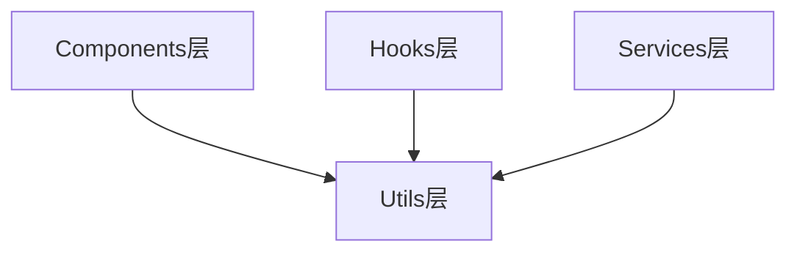

# Utils - 工具函数层

**架构定位（3行）**:

-   职责：提供可复用的纯函数工具，不依赖业务逻辑和状态
-   依赖：无（纯函数）或仅依赖标准库
-   输出：向其他层提供工具函数，提高代码复用性

⚠️ **自指声明**：一旦本文件夹有文件新增/删除/重命名，请立即更新本 README 的文件清单

---

## 工具架构



---

## 文件清单与功能说明

### announcementClassifier.ts

-   **地位**：公告分类工具
-   **功能**：基于规则匹配对公告标题进行智能分类
-   **关键函数**：
    -   `classifyAnnouncement()` - 单个公告分类
    -   `classifyAnnouncements()` - 批量公告分类
    -   `getCategoryColor()` - 获取分类颜色
    -   `getCategoryIcon()` - 获取分类图标
    -   `getCategoryStats()` - 获取分类统计
-   **分类规则**：基于863,580条公告的10,000条样本分析生成
-   **支持分类**：财务报告、分红派息、重大事项、股权变动等30+类别

### announcementClassifier.example.ts

-   **地位**：分类工具使用示例
-   **功能**：展示announcementClassifier的使用方法
-   **示例内容**：
    -   单个公告分类示例
    -   批量分类示例
    -   分类统计示例
    -   颜色和图标获取示例

---

## 工具使用示例

### 单个公告分类

```typescript
import { classifyAnnouncement, getCategoryColor, getCategoryIcon } from "../utils/announcementClassifier";

const title = "2023年年度报告";
const category = classifyAnnouncement(title);
const color = getCategoryColor(category);
const icon = getCategoryIcon(category);

console.log(`分类: ${category}, 颜色: ${color}, 图标: ${icon}`);
```

### 批量分类

```typescript
import { classifyAnnouncements } from "../utils/announcementClassifier";

const announcements = [
  { id: 1, title: "2023年年度报告", ts_code: "000001.SZ" },
  { id: 2, title: "关于分红派息的公告", ts_code: "000002.SZ" }
];

const classified = classifyAnnouncements(announcements);
// classified 中每个公告都有 category 字段
```

### 分类统计

```typescript
import { getCategoryStats } from "../utils/announcementClassifier";

const announcements = [
  { title: "2023年年度报告" },
  { title: "关于分红派息的公告" },
  { title: "2023年年度报告" }
];

const stats = getCategoryStats(announcements);
// stats: { "财务报告": 2, "分红派息": 1 }
```

---

## 工具设计原则

1. **纯函数**：工具函数应该是纯函数，无副作用
2. **可测试性**：易于单元测试
3. **文档化**：提供清晰的使用示例
4. **性能**：考虑性能优化（如批量处理）

---

## 扩展指南

**添加新工具时**：

1. 创建工具文件（如 `newUtil.ts`）
2. 添加标准 INPUT/OUTPUT/POS 注释头
3. 实现纯函数工具
4. 添加使用示例和文档
5. 更新本 README 的文件清单
6. 更新根目录 [`README.md`](../../README.md) 的架构说明

---

**最后更新**：2025-12-26

